# JuHye's Final Project: Portable MIDI Keyboard Controller



Description: A lightweight MIDI virtual instrument made from scratch (with an microcontroller~).
Weight: 12 oz. Height x Width: 4.0 inch x 8.0 inch. With casing: 6.0 inch x 8.0 inch

[Final version of my code](https://github.com/juhye-m/ps70-code/blob/master/code/addbutton.ino).
[All versions of my code](https://github.com/juhye-m/ps70-code/tree/master/code).

## Why a MIDI keyboard? 

As a Californian who flies back and forth to Boston for school, I often find myself forced to leave behind my instruments on the other side of the country. This is a huge barrier as a musician. 
Recently, during quarantine, I bought a MIDI keyboard that I love to play and write with. Unfortunately, I know it's only a matter of time before I have to say goodbye to it when I come back to campus in the fall (no jinx...). It's way too bullky to travel with, at almost 10 lb.
This brought me to wanting a digital instrument that was much more lightweight.


## Proposal

My project is to create a small, lightweight MIDI instrument. My primary sensors will be copper foil, and my design will be inspired by the classic keys of the western piano. The product will be able to be integrated into almost any DAW by translating the serial port data of the microcontroller into digestable data that other applications on my computer can take as input.
We'll get right into the nitty-gritty of this DIY project.

## Materials

For this project, we will need the following components:

- [1 Adafruit METRO M0 Express](https://www.adafruit.com/product/3505)
- [1 Micro-USB cable](https://www.adafruit.com/product/592)
    - Make sure it transmits data!
- [Copper tape](https://www.amazon.com/Conductive-Shielding-Repellent-Electrical-Grounding/dp/B0741ZRP4W)
    - Dimensions depend on the size of your midi keyboard. 12 1/4 inch x 1 inch is sufficient for a small diy keyboard.
- [Electrical tape](https://www.amazon.com/Wapodeai-Electrical-Temperature-Resistance-Waterproof/dp/B07ZWC2VLX/ref=zg_bs_256161011_1?_encoding=UTF8&psc=1&refRID=Z468QPXB4F43WRJ2HDTH)
    - Dimensions vary. 12 1/4 inch x 1/4 inch is sufficient for a small diy keyboard.
- [13 47 kilaohm resistors](https://www.digikey.com/en/resources/resistors)
- [Solid core wire](https://www.digikey.com/catalog/en/partgroup/solid-hook-up-wire/1915)
    - 5+ feet suggested, to be on the safer side!
- [13 Female to female jumper wires](https://www.amazon.com/uxcell-Female-Jumper-2-54mm-Breadboard/dp/B07FM72VBF/ref=sr_1_18?crid=2TC1J87WAYC9O&dchild=1&keywords=electrical+jumper+wires+female+to+female&qid=1620902792&sprefix=electrical+jumper+wires%2Caps%2C229&sr=8-18)
- [1 Breadboard)](https://www.amazon.com/DEYUE-Solderless-Prototype-Breadboard-Points/dp/B07NVWR495/ref=sr_1_6?dchild=1&keywords=breadboard&qid=1619547333&sr=8-6])
    - (and one smaller breadboard)
- [1 push button](https://www.amazon.com/Momentary-Tactile-Through-Breadboard-Friendly/dp/B07WF76VHT?ref_=Oct_s9_apbd_otopr_hd_bw_b6GQCmB&pf_rd_r=Y7GBPXHGVFGR172HMQFF&pf_rd_p=c088ae4d-8e6e-5dd1-bd97-f107186170d5&pf_rd_s=merchandised-search-10&pf_rd_t=BROWSE&pf_rd_i=5739464011)
- 1 10k ohm resistor
- [Casing (Optional)]
    - 3D printed keyboard (optional)
    - Cardboard (optional)
    - Plastic bin (optional)

#### Virtual components
- [1 Digital Audio Workspace (Logic Pro X)](https://www.apple.com/logic-pro/)
    - [Free alternative: Reaper](https://www.reaper.fm)


## Part 1: MIDI

#### What is MIDI?
MIDI refers to a protocol for communication, digital interface, and electrical connectors  -- formally called Musical Instrument Digital Interface. It was developed in the 80s. The reason why MIDI devices do not produce audio on their own is because MIDI does not provide actual audio signals. It is simply data and information that does not include audio signals.

#### What is IAC?
IAC stands for Inter-Application Communitation. The IAC Driver is Apple's default MIDI device that you can use to communicate to Applications (such as Logic Pro X) that I use here. I must set up IAC drivers -- it doesn't set itself up automatically.

#### Serial MIDI 

Before I worked on all of other elements, I needed to work on the software side and make sure I can run a very simple MIDI data transmission. In order to do that and to make sure that this idea would work, I set up a simple button control ciruit. 
Because I wanted to avoid buying more parts including midi input and midi wires, I researched how I could use alternative ways to do this project. I found a few blogs that used "Hairless MIDI" which is a software that allowed access to the Arduino serial monitor and converted the data to midi. Unfortunately, it turns out that Hairless midi stopped working on the new Mac OS!! This was extrememely disappointing. However, I found a github repository that created a python version of Hairless midi. It was just one man, Ryan Kojima, who wrote this up, and there was little documentation. So, I've detailed my own documentation for this program: 
<!-- WRITE HEREE ABOUT THE PYTHON PROGRAM -->

First we import the necessary libraries. The serial library makes serial ports accessible from your program. The rtmidi library consists of C++ classes to provide an API (Application Programming Interface) for MIDI input and output. Read more about the [serial](https://pyserial.readthedocs.io/en/latest/) and [rtmidi](https://pypi.org/project/python-rtmidi/) libraries as linked. Note that we also use the Python threading library. Threading lets us run multiple "threads", or tasks, in parallel. You can learn the basics on this [Wiki page](https://en.wikibooks.org/wiki/Python_Programming/Threading).
``` py
import time
import queue
import rtmidi
import serial
import threading
import logging
import sys
import time
import argparse
```

We take as input and then parse the command-line arguments into a list. The program allows for 5 arguments. You must provide the name of the serial port you are trying to read from. You also should provide the baud rate, and the midi in and out names. If you don't provide the latter 3 arguments, they default to the respective strings (see below). You can add a debug flag to help debug issues you may have. 
```py
parser = argparse.ArgumentParser(description = "Serial MIDI bridge")

parser.add_argument("--serial_name", type=str, required = True, help = "Serial port name. Required")
parser.add_argument("--baud", type=int, default=115200, help = "baud rate. Default is 115200")
parser.add_argument("--midi_in_name", type=str, default = "IAC Bus 1")
parser.add_argument("--midi_out_name", type=str, default = "IAC Bus 2")
parser.add_argument("--debug", action = "store_true", help = "Print incoming / outgoing MIDI signals")

args = parser.parse_args()

thread_running = True

# Arguments
serial_port_name = args.serial_name #'/dev/cu.SLAB_USBtoUART'
serial_baud = args.baud
given_port_name_in = args.midi_in_name #"IAC Bus 1"
given_port_name_out = args.midi_out_name #"IAC Bus 2"

if args.debug:
    logging.basicConfig(level = logging.DEBUG)
else:
    logging.basicConfig(level = logging.INFO)

```
Here, we deal with MIDI data. We have our midi data, which comes in three numbers, from our code which we will go over later: the command, the note, and the velocity. The command follows midi protocol, where [each number has a designated function](https://computermusicresource.com/MIDI.Commands.html). The second argument gives the tone of the note, and the third is the loudness. The program here adds these midi data messages into a queue that we can go through, and decode using the midi protocol.

```py
midi_ready = False
midiin_message_queue = queue.Queue()
midiout_message_queue = queue.Queue()

def get_midi_length(message):
    if len(message) == 0:
        return 100
    opcode = message[0]
    if opcode >= 0xf4:
        return 1
    if opcode in [ 0xf1, 0xf3 ]:
        return 2
    if opcode == 0xf2:
        return 3
    if opcode == 0xf0:
        if message[-1] == 0xf7:
            return len(message)

    opcode = opcode & 0xf0
    if opcode in [ 0x80, 0x90, 0xa0, 0xb0, 0xe0 ]:
        return 3
    if opcode in [ 0xc0, 0xd0 ]:
        return 2

    return 100
```
Next, we access the serial port. Recall that we need this program to allow communication between the microcontroller's serial port and its outputted midi data to go to other applications. This program is then essentially a translator, or a middle man. The program is continuously watching the serial port in a while loop so that no data slips through.

```py
def serial_writer():
    while midi_ready == False:
        time.sleep(0.1)
    while thread_running:
        try:
            message = midiin_message_queue.get(timeout=0.4)
        except queue.Empty:
            continue
        logging.debug(message)
        value = bytearray(message)
        ser.write(value)

def serial_watcher():
    receiving_message = []
    running_status = 0

    while midi_ready == False:
        time.sleep(0.1)

    while thread_running:
        data = ser.read()
        if data:
            for elem in data:
                receiving_message.append(elem)
            #Running status
            if len(receiving_message) == 1:
                if (receiving_message[0]&0xf0) != 0:
                    running_status = receiving_message[0]
                else:
                    receiving_message = [ running_status, receiving_message[0] ]

            message_length = get_midi_length(receiving_message)
            if message_length <= len(receiving_message):
                logging.debug(receiving_message)
                midiout_message_queue.put(receiving_message)
                receiving_message = []

```

The program then needs to take the midi messages and actually channel it into the IAC buses that I created. It does so by creating a midi input handler, and it tells the bus timestamps along with the data. Finally, the program outlines debugging and other logistical functions, such as quit program.
```py

class midi_input_handler(object):
    def __init__(self, port):
        self.port = port
        self._wallclock = time.time()

    def __call__(self, event, data=None):
        message, deltatime = event
        self._wallclock += deltatime
        #logging.debug("[%s] @%0.6f %r" % (self.port, self._wallclock, message))
        midiin_message_queue.put(message)

def midi_watcher():
    global midi_ready, thread_running

    midiin = rtmidi.MidiIn()
    midiout = rtmidi.MidiOut()
    available_ports_out = midiout.get_ports()
    available_ports_in = midiin.get_ports()
    logging.info("IN : '" + "','".join(available_ports_in) + "'")
    logging.info("OUT : '" + "','".join(available_ports_out) + "'")
    logging.info("Hit ctrl-c to exit")

    port_index_in = -1
    port_index_out = -1
    for i, s in enumerate(available_ports_in):
        if given_port_name_in in s:
            port_index_in = i
    for i, s in enumerate(available_ports_out):
        if given_port_name_out in s:
            port_index_out = i

    if port_index_in == -1:
        print("MIDI IN Device name is incorrect. Please use listed device name.")
    if port_index_out == -1:
        print("MIDI OUT Device name is incorrect. Please use listed device name.")
    if port_index_in == -1 or port_index_out == -1:
        thread_running = False
        midi_ready = True
        sys.exit()

    midiout.open_port(port_index_out)
    in_port_name = midiin.open_port(port_index_in)

    midi_ready = True

    midiin.ignore_types(sysex = False, timing = False, active_sense = False)
    midiin.set_callback(midi_input_handler(in_port_name))

    while thread_running:
        try:
            message = midiout_message_queue.get(timeout = 0.4)
        except queue.Empty:
            continue
        midiout.send_message(message)

try:
    ser = serial.Serial(serial_port_name,serial_baud)
    ser.setDTR()
except serial.serialutil.SerialException:
    print("Serial port opening error.")
    midi_watcher()
    sys.exit()

ser.timeout = 0.4

s_watcher = threading.Thread(target = serial_watcher)
s_writer = threading.Thread(target = serial_writer)
m_watcher = threading.Thread(target = midi_watcher)

s_watcher.start()
s_writer.start()
m_watcher.start()

#Ctrl-C handler
try:
    while True:
        time.sleep(1)
except KeyboardInterrupt:
    print("Terminating.")
    thread_running = False
    sys.exit(0)
```

In order for this software to work and to communicate between the DAW as well as the serial monitor for my Metro, I had to create new IAP audio inputs and outputs. These are busses that allow for the audio to be channeled later in the DAW. 


I had some trouble getting this to work, however. I kept getting the error that my serial port was unable to open. 

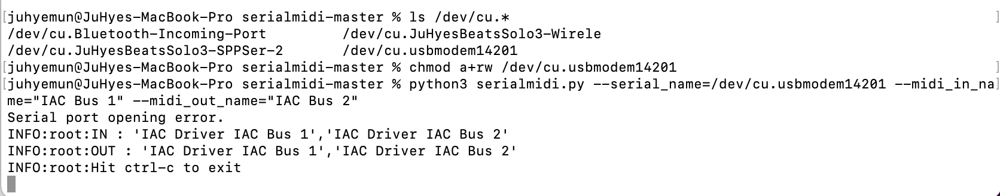

After trying different debugging methods, such as looking at the code carefully, checking serial monitor output, and other possible issues, I learned from Professor Melenbrink that the issue is that I can't have the serial monitor open in two places (so when the program runs, that counts), which I was reminded of. 

#### Part 1 Product: Simple button MIDI circuit
Then, I plugged my midi button circuit as input to my DAW, Logic Pro, and here is the result!



For my code, I used the MIDImessage Arduino function. It takes as parameters (noteON, pitch, velocity). These are decimal values, which are converted into binary. More info [here](https://www.instructables.com/What-is-MIDI/)!


## Part 2: Capacitive Touch

I wrote custom code to measure capacitive touch and turn that data into midi data to use in a DAW! 
First, I set up my circuit like so (this is something we went over in earlier weeks):


I used the Arduino CapacitiveSensor library.
```cpp
#include <CapacitiveSensor.h>

CapacitiveSensor Sensor = CapacitiveSensor(7,5);  //7 is charge pin.  5 is sense pin.

void setup(){
  Serial.begin(115200);//initialize Serial connection
}
void loop(){
  long sensorValue = Sensor.capacitiveSensor(1000);
  Serial.println(sensorValue);
}
```

The idea was that when the sensor outputs beyond a certain threshold, a midi note would be sent as output. When the capacitive sensor is below a certain threshold, the midi note is no longer playing. The capacitive sensor has more flexibility and versatility than the button midi circuit I built last week. This is because copper tape capacitive sensoring is not a binary, but is a function of how much resistance I am putting on the tape! Because of this, I could control velocity of my midi output. (note: velocity in the context of MIDI is a synonym to loudness). I also accounted for this in my code. 127 represents the loudest a midi note can be tagged for. 0 is the smallest. My approach was to first test the range of numbers outputted by the capacitive sensor, and wrote in threshold values according to what was reasonable. For the current setup, I decided to use 40000 as the high threshold, 20000 as a medium threshold, and 1000 as a low threshold. These would in turn represent high, low, and medium velocities, respectfully. These numbers were set to variables so that the threshold values can be easily manipulated based on the sensor sensitivity.

[MIDI commands](https://computermusicresource.com/MIDI.Commands.html)

Here is my code:
```cpp
#include <CapacitiveSensor.h>

CapacitiveSensor Sensor = CapacitiveSensor(7,5);  // 7 is charge pin.  5 is sense pin.
byte noteON = 144; // MIDI command for turning a note on

long currentState = 0; //stores current state
long lastState = 0;    //stores last state

void setup(){
  Serial.begin(115200); //initialize Serial connection
}

void loop(){
  long sensorValue = Sensor.capacitiveSensor(1000);
  sensorValue = map(sensorValue, 0,300000, 0, 127);
  currentState = sensorValue;
  int high = 30;
  int low = 0;
  if (currentState > high  && lastState == low){
    MIDImessage(noteON, 60, 127); //turn on note 60 with 127 velocity
    delay(200); // debouncing
  } else if(currentState <= high  && lastState == low){
    MIDImessage(noteON, 62, 0); //turn off note 60
    delay(10); // debouncing
  }
  lastState = currentState;
}
```

#### Fixing the MIDI not-saving issue

The issue was that the serial port was outputting values that were too high. That's why it was outputting junk, as shown below.
This problem was address by mapping the values to a certain range. By doing so, the values generated by the capacitive sensor are converted to a better, workable range. 
```cpp
  long sensorValue = Sensor.capacitiveSensor(1000);
  sensorValue = map(sensorValue, 0,1000000, 0, 127);
```
I also made variables for the high and low values in order to abstract some of the code.
I cleaned up and condensed the code as well.

Here is the rest of it:
```cpp

byte noteON = 144;//note on command

long currentState = 0;//storage for current state
long lastState = 0;//storage for last state

void setup(){
  Serial.begin(115200);//initialize Serial connection
}
void loop(){
  long sensorValue = Sensor.capacitiveSensor(1000);
  sensorValue = map(sensorValue, 0,1000000, 0, 127);
  //map sensor value and go into trackable 
  // put a plateau on a value/upper threshold

  currentState = sensorValue;
  int high = 50;
  int low = 0;
  if (currentState > high  && lastState == low){
    MIDImessage(noteON, 60, 127);//turn note 60 on with 127 velocity
    delay(200); // debouncing
  } else if(currentState <= high  && lastState == low){
    MIDImessage(noteON, 60, 0);//turn note 60 off
    delay(10);// debouncing
  }
  lastState = currentState;

//  Serial.println(sensorValue); // Debugging
//  Serial.println(currentState);
}
//send MIDI message
void MIDImessage(byte command, byte data1, byte data2) {
  Serial.write(command);
  Serial.write(data1);
  Serial.write(data2);
}
```

This is the functional capacitive touch (using copper tape) midi control!


I have now gotten a button and a single square of copper tape to both transmit MIDI data to my DAW. Now, I need to expand this to multiple inputs, i.e. 12 pieces of copper tape. Each sensor should correspond to a specific note on the Western chormatic scale. In order to do this, I not only need to add more sensors to the circuit, but I need to modify the code so that it can send multiple instances of MIDI data.

## Part 3.1: Circuitry
I knew I needed a lot of wiring to accomodate for 13 sensors, so I kept organized by first prototyping the circuit in TinkerCAD. 
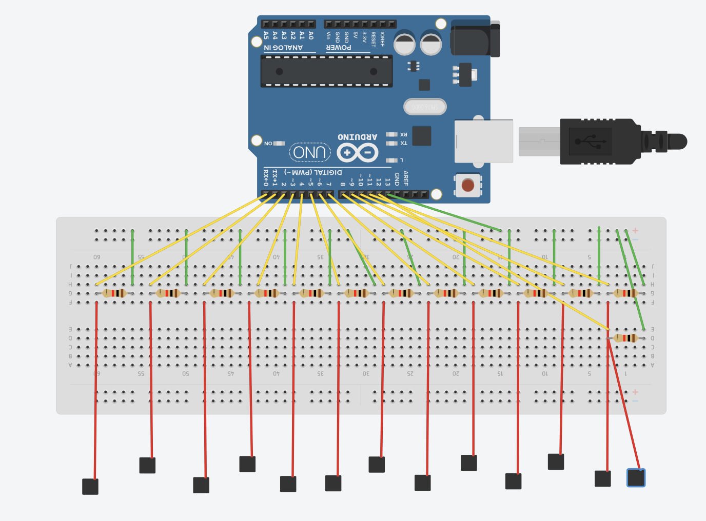

I used 10 47k ohm resistors and 3 100k ohm resistors, due to limited supplies. Because of the different levels of resistance, I adjusted and accommodated for the difference on the software side, as I'll discuss later.

Due to the number of wires I was dealing with, it was crucial that I kept my breadboard neat. Though it was time-consuming, I trimmed all jumper wires and resistors in order to sit flatly on the breadboard. Keeping a neat circuit makes it easier to identify possible bugs and to double check connections. This came to be very helpful later during the casing stage as well.

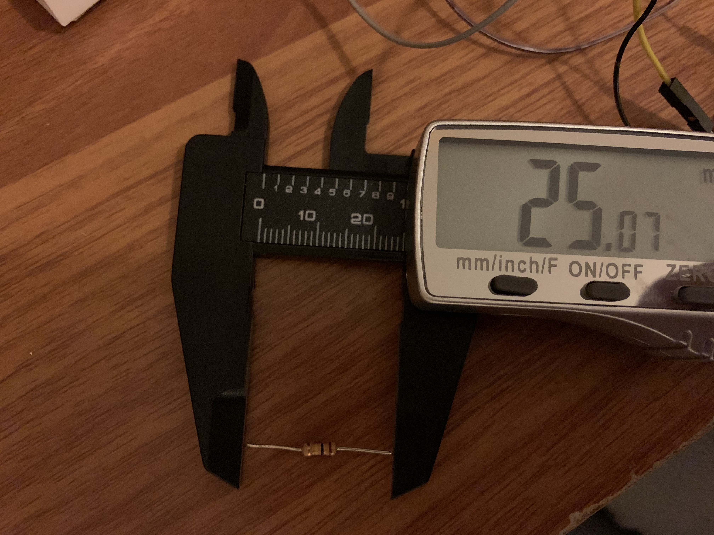

This was the result! The patience was definitely worth it (this took me multiple hours)...


## Part 3.2: Multiple Sensors

I first started with two sensors, to see if my code could make sense of it (pun-intended...).
I did this by creating another path to a copper tape capacitive touch sensor. The source pin is the same. I first created more parameters to the MIDImessage function, as I thought I could just add more data options there. I had trouble with calibrating the sensors to map it to the right, digestable values at first. It took a lot of trial and error. I used the following functions to print to the serial monitor and calibrate the sensors while distinguishing the two.

```cpp
 Serial.print(sensorValue); // Debugging
 Serial.print(" , ");
 Serial.println(sensorValue2); // Debugging
```

What this does is it prints the sensor values of my two sensors to the serial monitor in this format:
sensorVal1, sensorVal2
where the two entities are longs (aka, a form of integer).

 I played around with the map parameters, as well as adjusted the "low" and "high" thresholds. After a couple hours of repeating this process, it seemed to work, so I moved forward with it. 
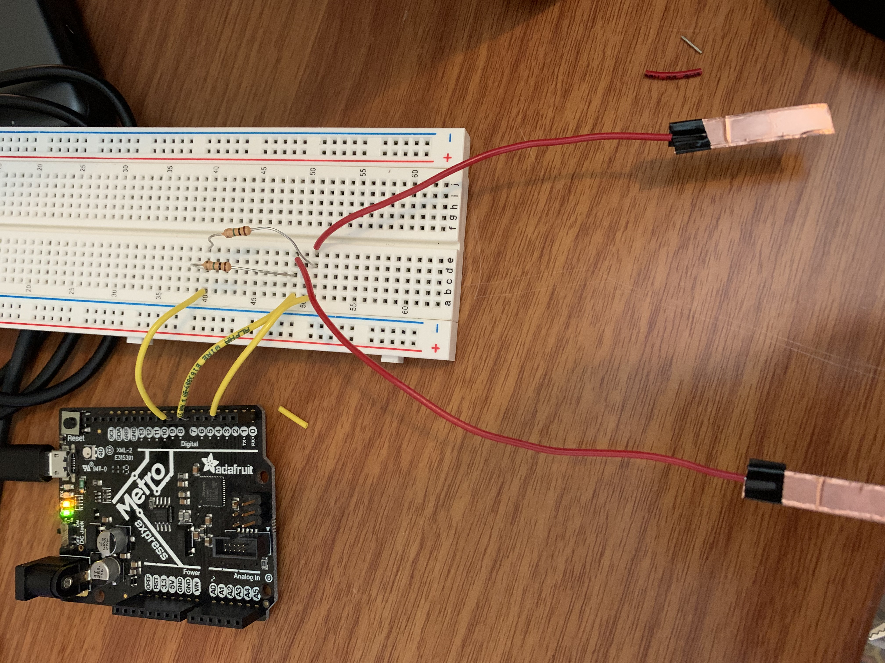




I started to work on the physical component of the circuit, and expanded to all "white" keys (natural notes in C major).
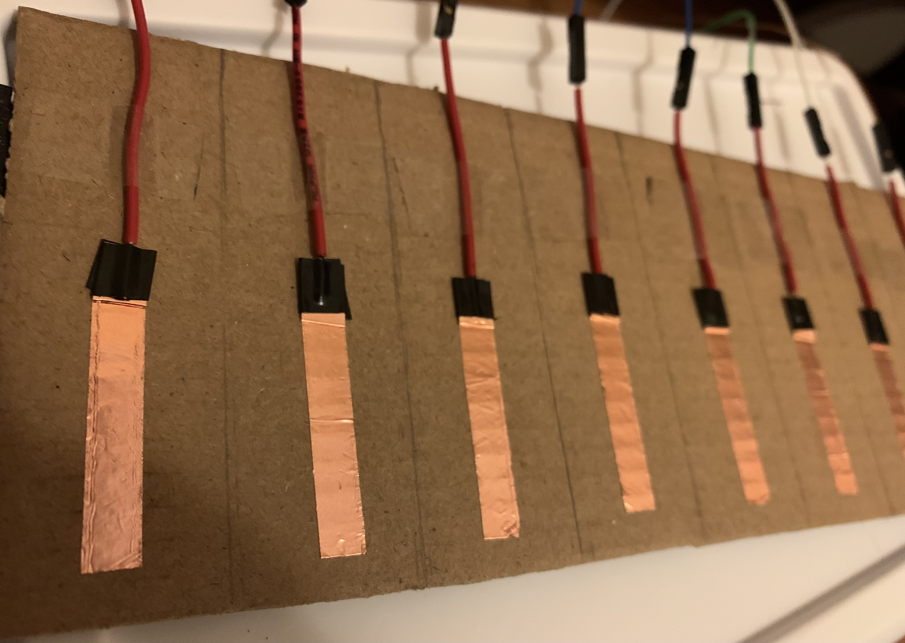

However, I soon realized that as I expanded this code to multiple copper tapes, it would became very repetitive and look messy and inefficient. 

Here was my code for this expanded portion:
```cpp
#include <CapacitiveSensor.h>

CapacitiveSensor Sensor = CapacitiveSensor(13,0);  //7 is charge pin.  5 is sense pin.
CapacitiveSensor Sensor2 = CapacitiveSensor(13,1);  
CapacitiveSensor Sensor3 = CapacitiveSensor(13,2);  
CapacitiveSensor Sensor4 = CapacitiveSensor(13,3);  
CapacitiveSensor Sensor5 = CapacitiveSensor(13,4);  
CapacitiveSensor Sensor6 = CapacitiveSensor(13,5);  
CapacitiveSensor Sensor7 = CapacitiveSensor(13,6); 
CapacitiveSensor Sensor8 = CapacitiveSensor(13,7);  
CapacitiveSensor Sensor9 = CapacitiveSensor(13,8);  
CapacitiveSensor Sensor10 = CapacitiveSensor(13,9); 
CapacitiveSensor Sensor11 = CapacitiveSensor(13,10);  
CapacitiveSensor Sensor12 = CapacitiveSensor(13,11); 
CapacitiveSensor Sensor13 = CapacitiveSensor(13,12);  

byte noteON = 144;//note on command

long currentState = 0;//stroage for current state
long lastState = 0;//storage for last state
long currentState2 = 0;
long lastState2 = 0;
long currentState3 = 0;
long lastState3 = 0;
long currentState4 = 0;
long lastState4 = 0;
long currentState5 = 0;
long lastState5 = 0;
long currentState6 = 0;
long lastState6 = 0;
long currentState7 = 0;
long lastState7 = 0;
long currentState8 = 0;
long lastState8 = 0;
long currentState9 = 0;
long lastState9 = 0;
long currentState10 = 0;
long lastState10 = 0;
long currentState11 = 0;
long lastState11 = 0;
long currentState12 = 0;
long lastState12 = 0;
long currentState13 = 0;
long lastState13 = 0;

void setup(){
  Serial.begin(115200);//initialize Serial connection
}

void loop(){
  long sensorValue = Sensor.capacitiveSensor(1000);
  sensorValue = map(sensorValue, 0,5000, 0, 127);
  long sensorValue2 = Sensor2.capacitiveSensor(1000);
  sensorValue2 = map(sensorValue2, 0,5000, 0, 127);
  long sensorValue3 = Sensor3.capacitiveSensor(1000);
  sensorValue3 = map(sensorValue3, 0,5000, 0, 127);
  long sensorValue4 = Sensor4.capacitiveSensor(1000);
  sensorValue4 = map(sensorValue4, 0,5000, 0, 127);
  long sensorValue5 = Sensor5.capacitiveSensor(1000);
  sensorValue5 = map(sensorValue5, 0,5000, 0, 127);
  long sensorValue6 = Sensor6.capacitiveSensor(1000);
  sensorValue6 = map(sensorValue6, 0,5000, 0, 127);
  long sensorValue7 = Sensor7.capacitiveSensor(1000);
  sensorValue7 = map(sensorValue7, 0,5000, 0, 127);
  long sensorValue8 = Sensor8.capacitiveSensor(1000);
  sensorValue8 = map(sensorValue8, 0,5000, 0, 127);
    long sensorValue9 = Sensor9.capacitiveSensor(1000);
  sensorValue9 = map(sensorValue9, 0,5000, 0, 127);
  long sensorValue10 = Sensor10.capacitiveSensor(1000);
  sensorValue10 = map(sensorValue10, 0,5000, 0, 127);
    long sensorValue11 = Sensor11.capacitiveSensor(1000);
  sensorValue11 = map(sensorValue11, 0, 10000, 0, 127);
    long sensorValue12 = Sensor12.capacitiveSensor(1000);
  sensorValue12 = map(sensorValue12, 0,10000, 0, 127);
  long sensorValue13 = Sensor13.capacitiveSensor(1000);
  sensorValue13 = map(sensorValue13, 0,10000, 0, 127);

  //map sensor value and go into trackable 
  // put a plateau on a value/upper threshold

  currentState = sensorValue;
  currentState2 = sensorValue2;
  currentState3 = sensorValue3;
  currentState4 = sensorValue4;
    currentState5 = sensorValue5;
  currentState6 = sensorValue6;
  currentState7 = sensorValue7;
    currentState8 = sensorValue8;
  currentState9 = sensorValue9;
  currentState10 = sensorValue10;
      currentState11 = sensorValue11;
  currentState12 = sensorValue12;
  currentState13 = sensorValue13;
  int high = 8;
  int low = 5;

  if (currentState > high  && lastState < low){
    MIDImessage(noteON, 60, 127, 0, 0,0,0);//turn note 60 on with 127 velocity
    delay(10);//crude form of button debouncing
  } else if(currentState <= high  && lastState < low){
    MIDImessage(noteON, 60, 0, 0, 0,0,0);//turn note 60 off
    delay(10);//crude form of button debouncing
  }
  lastState = currentState;
  if (currentState2 > high  && lastState2 < low){
    MIDImessage(noteON, 0, 0, 61, 127,0,0);//turn note 60 on with 127 velocity
    delay(10);//crude form of button debouncing
  } else if(currentState2 <= high  && lastState2 < low){
    MIDImessage(noteON, 0, 0, 61, 0,0,0);//turn note 60 off
    delay(10);//crude form of button debouncing
  }
  lastState2 = currentState2;
    if (currentState3> high  && lastState3 < low){
    MIDImessage(noteON, 0, 0, 62, 127,0,0);//turn note 60 on with 127 velocity
    delay(10);//crude form of button debouncing
  } else if(currentState3 <= high  && lastState3 < low){
    MIDImessage(noteON, 0, 0, 62, 0,0,0);//turn note 60 off
    delay(10);//crude form of button debouncing
  }
  lastState3 = currentState3;
    if (currentState4 > high  && lastState4 < low){
    MIDImessage(noteON, 0, 0, 63, 127,0,0);//turn note 60 on with 127 velocity
    delay(10);//crude form of button debouncing
  } else if(currentState4 <= high  && lastState4 < low){
    MIDImessage(noteON, 0, 0, 63, 0,0,0);//turn note 60 off
    delay(10);//crude form of button debouncing
  }
  lastState4 = currentState4;
  
      if (currentState5 > high  && lastState5 < low){
    MIDImessage(noteON, 0, 0, 64, 127,0,0);//turn note 60 on with 127 velocity
    delay(10);//crude form of button debouncing
  } else if(currentState5 <= high  && lastState5 < low){
    MIDImessage(noteON, 0, 0, 64, 0,0,0);//turn note 60 off
    delay(10);//crude form of button debouncing
  }
    lastState5 = currentState5;
    
  if (currentState6 > high  && lastState6 < low){
    MIDImessage(noteON, 0, 0, 65, 127,0,0);//turn note 60 on with 127 velocity
    delay(10);//crude form of button debouncing
  } else if(currentState6 <= high  && lastState6 < low){
    MIDImessage(noteON, 0, 0, 65, 0,0,0);//turn note 60 off
    delay(10);//crude form of button debouncing
  }
  lastState6 = currentState6;

    if (currentState7 > high  && lastState7 < low){
    MIDImessage(noteON, 0, 0, 0,0, 66, 127);//turn note 60 on with 127 velocity
    delay(10);//crude form of button debouncing
  } else if(currentState7 <= high  && lastState7 < low){
    MIDImessage(noteON, 0, 0, 0,0,66, 0);//turn note 60 off
    delay(10);//crude form of button debouncing
  }
  lastState7 = currentState7;
 
    if (currentState8> high  && lastState8 < low){
    MIDImessage(noteON, 0, 0, 0,0,67, 127);//turn note 60 on with 127 velocity
    delay(10);//crude form of button debouncing
  } else if(currentState8 <= high  && lastState8 < low){
    MIDImessage(noteON, 0, 0,0,0, 67, 0);//turn note 60 off
    delay(10);//crude form of button debouncing
  }
  lastState8 = currentState8;
    if (currentState9 > high  && lastState9 < low){
    MIDImessage(noteON, 0, 0, 0,0,68, 127);//turn note 60 on with 127 velocity
    delay(10);//crude form of button debouncing
  } else if(currentState9 <= high  && lastState9 < low){
    MIDImessage(noteON, 0, 0, 0,0,68, 0);//turn note 60 off
    delay(10);//crude form of button debouncing
  }
  lastState9 = currentState9;

    if (currentState10 > high  && lastState10 < low){
    MIDImessage(noteON, 0, 0, 0,0, 69, 127);//turn note 60 on with 127 velocity
    delay(10);//crude form of button debouncing
  } else if(currentState10 <= high  && lastState10 < low){
    MIDImessage(noteON, 0, 0,0,0, 69, 0);//turn note 60 off
    delay(10);
  }
  lastState10 = currentState10;

      if (currentState11 > high  && lastState11 < low){
    MIDImessage(noteON, 0, 0, 0,0, 70, 127);//turn note 60 on with 127 velocity
    delay(10);
  } else if(currentState11 <= high  && lastState11 < low){
    MIDImessage(noteON, 0, 0,0,0, 70, 0);//turn note 60 off
    delay(10);
  }
  lastState11 = currentState11;

      if (currentState12 > high  && lastState12 < low){
    MIDImessage(noteON, 0, 0, 0,0, 71, 127);//turn note 60 on with 127 velocity
    delay(10);
  } else if(currentState12 <= high  && lastState12 < low){
    MIDImessage(noteON, 0, 0,0,0, 71, 0);//turn note 60 off
    delay(10);
  }
  lastState12 = currentState12;

      if (currentState13 > high  && lastState13 < low){
    MIDImessage(noteON, 0, 0, 0,0, 72, 127);//turn note 60 on with 127 velocity
    delay(10);
  } else if(currentState13 <= high  && lastState13 < low){
    MIDImessage(noteON, 0, 0,0,0, 72, 0);//turn note 60 off
    delay(10);
  }
  lastState13 = currentState13;
}
//send MIDI message

void MIDImessage(byte command, byte data1, byte data2, byte data3, byte data4, byte data5, byte data6) {
  Serial.write(command);
  Serial.write(data1);
  Serial.write(data2);
  Serial.write(command);
  Serial.write(data3);
  Serial.write(data4);
  Serial.write(command);
  Serial.write(data5);
  Serial.write(data6);
}
```

I went forward with this code, knowing it could be much better. I needed to still focus on the physical and visual aspect, so that was my next step. However! Don't be alarmed! I made my code MUCH cleaner for the final, which took me some hard thinking, but I'm proud of the work!

## Part 4: Casing

When it comes to a product, the visual and aesthetic of it can really make or break people's first impression of it! For my final project, I wanted to case my midi controller in a mini piano-keyboard. I wanted my MIDI keyboard to look very compact and small. I edited files of a synth keyboard from [Thingyverse](https://www.thingiverse.com/thing:2760653).
I got rid of the huge letters on the top face, the labels, and smoothed down the back face. I also created a small window on the top face, in case I wanted to fit anything out of the face.

Here are the [STL files](). 

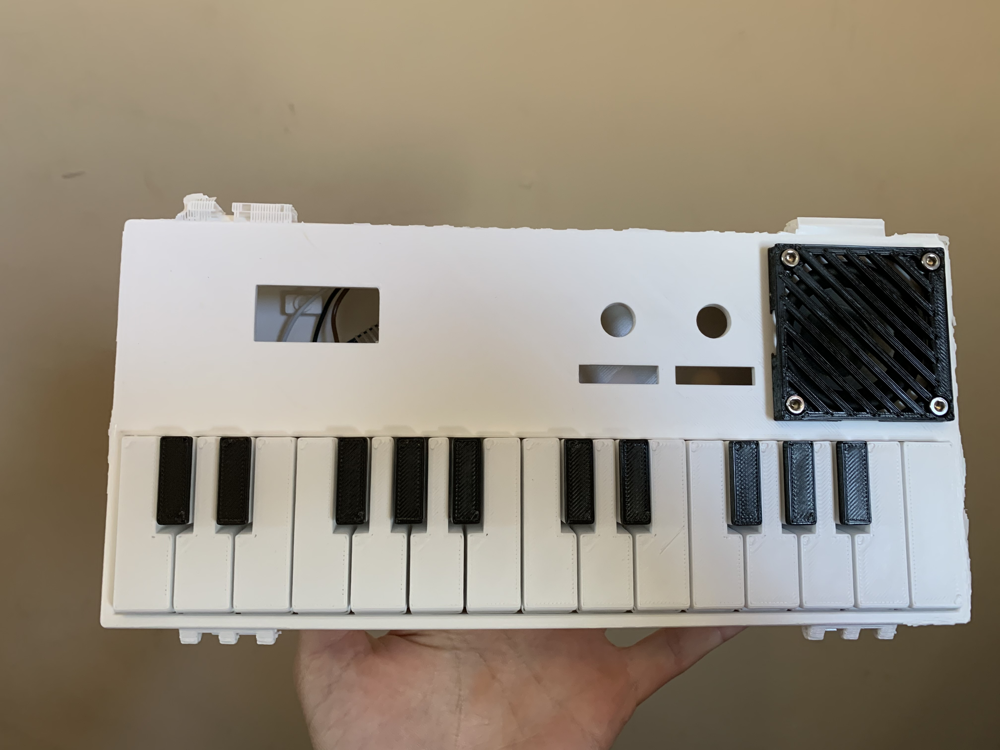
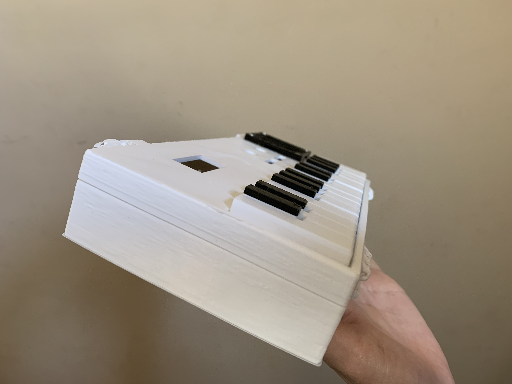

#### Integrating with the 3D printed parts
First, I cut the cardboard to be the same size as the keys.
Then, I cut the copper tape to 1 inch by 1/4 inch.
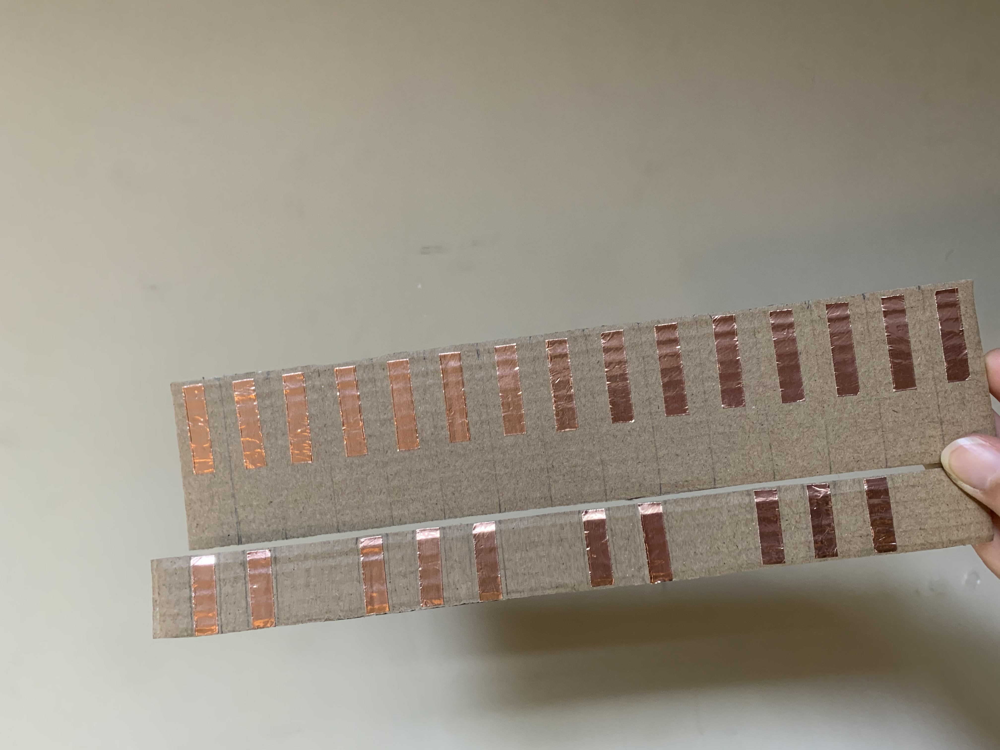

I then compared to the keys, which will be the case over the copper tape sensors.
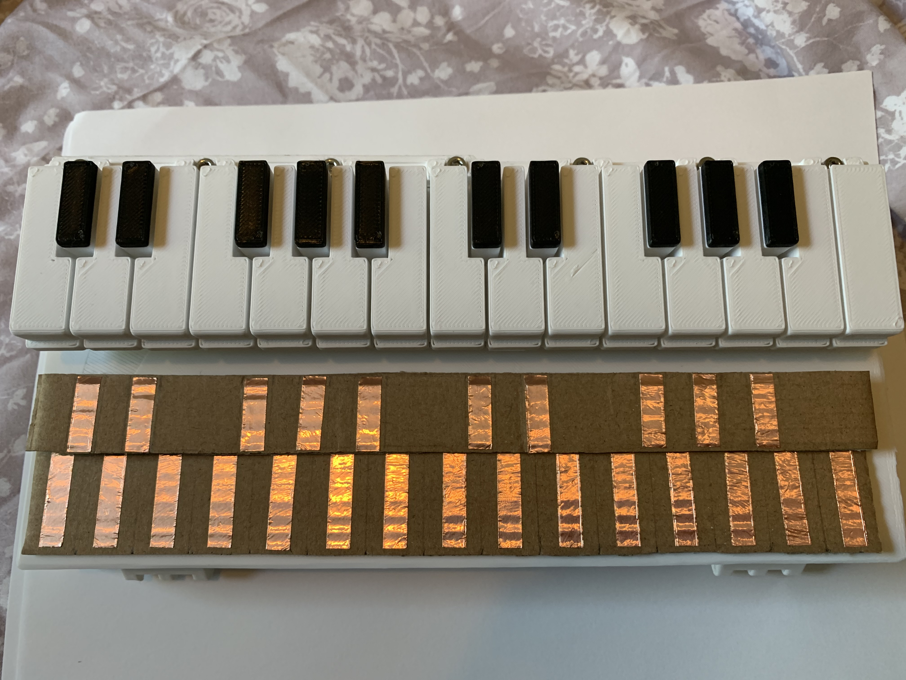

However, as I started to wire together my circuit, I realized that I simply did not have enoough material (or pins!) to hook up 25 keys. This was definitely a big roadblock for me, and a huge lesson learned in how it is important to keep this at the forefront of my planning. 

#### Handmade Pivot!
It was difficult given I didn't have much outside resources (except the amazing class package we have, which is honestly more than enough!), but I made do with cardboard and a plastic bin. 

My white keys were 20 mm in width and 2 inches in height. My copper tape pieces were 1 inch long, and 1/4 inch wide. These were the measurements I made prior to building my instrument. I was careful to minimize any discreepancies between the keys, as I knew that the capacitive touch sensors were... sensitive..,. and that small differences could make a big issue. 

Using the capacitive testing from above, I expanded to this one-octave cardboard keyboard and here is my progress:


Since a huge goal of my final project was to create a portable instrument, it was important to keep the casing minimal! I really like the way this turned out. The cardboard is even more lightweight than the 3D printed plastic. It lies right flat on the ground and is very thin, which makes it extremely portable. All in all, it still served its function and original aesthetic very well. I like how it looks "indie", too. 

I used a plastic bin for both support and for a casing. I taped my wires to the sides and on the inside of the bin in order to conceal the majority of the circuit, for a more minimalistic and less overwhelming look. The bin's height also adds a nice dimension -- sort of like a laptop stand, but for my midi keyboard.

Here is the outside of my midi keyboard
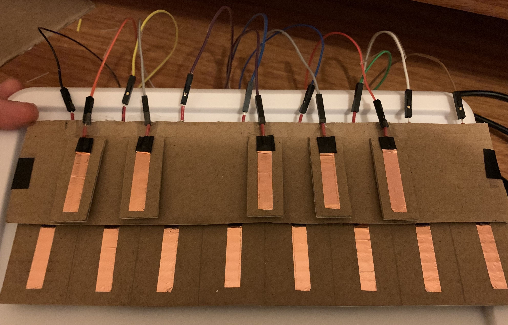

And here is the inside!
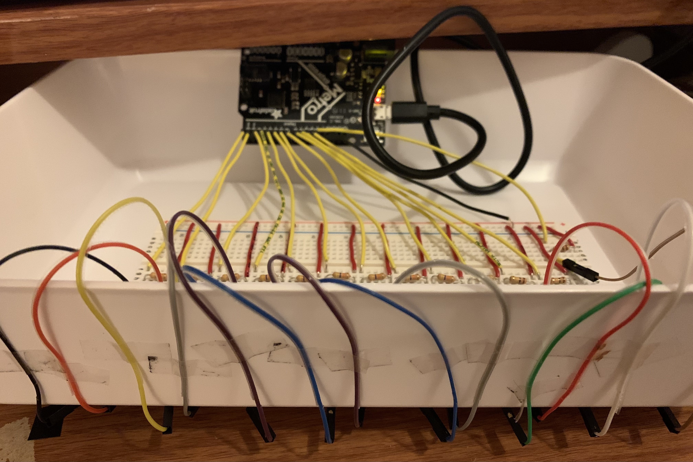

## Part 5: Cleaning up my code

I was able to wrap a lot of my previous code into for loops, by creating arrays for the current/last state, sensorvalue variables. Here is the clean version:

```cpp
#include <CapacitiveSensor.h>

CapacitiveSensor Sensor = CapacitiveSensor(13,0);  //13 is charge pin.  0 is sense pin.
CapacitiveSensor Sensor2 = CapacitiveSensor(13,1);  
CapacitiveSensor Sensor3 = CapacitiveSensor(13,2);  
CapacitiveSensor Sensor4 = CapacitiveSensor(13,3);  
CapacitiveSensor Sensor5 = CapacitiveSensor(13,4);  
CapacitiveSensor Sensor6 = CapacitiveSensor(13,5);  
CapacitiveSensor Sensor7 = CapacitiveSensor(13,6); 
CapacitiveSensor Sensor8 = CapacitiveSensor(13,7);  
CapacitiveSensor Sensor9 = CapacitiveSensor(13,8);  
CapacitiveSensor Sensor10 = CapacitiveSensor(13,9); 
CapacitiveSensor Sensor11 = CapacitiveSensor(13,10);  
CapacitiveSensor Sensor12 = CapacitiveSensor(13,11); 
CapacitiveSensor Sensor13 = CapacitiveSensor(13,12);  

//note on MIDI command
byte noteON[13] = {144, 145, 146, 147, 148, 149, 150, 151, 152, 153, 154, 155, 156}; 
//byte noteON[13] = {144, 144, 144, 144, 144, 144, 144, 144, 144, 144, 144, 144, 144}; 
byte tones[13] = {60, 61, 62, 63, 64, 65, 66, 67, 68, 69, 70, 71, 72};

// stores current state
long currentStates[13] = {
  0,0,0,0,0,0,0,0,0,0,0,0,0
};

// stores previous state
long lastStates[13] ={
  0,0,0,0,0,0,0,0,0,0,0,0,0
};

void setup(){
  Serial.begin(115200);//initialize Serial connection
}

void loop(){
  
  // put the sensor values into an array
  long sensorValues[13] = {
    Sensor.capacitiveSensor(1000),
    Sensor2.capacitiveSensor(1000),
    Sensor3.capacitiveSensor(1000),
    Sensor4.capacitiveSensor(1000),
    Sensor5.capacitiveSensor(1000),
    Sensor6.capacitiveSensor(1000),
    Sensor7.capacitiveSensor(1000),
    Sensor8.capacitiveSensor(1000),
    Sensor9.capacitiveSensor(1000),
    Sensor10.capacitiveSensor(1000),
    Sensor11.capacitiveSensor(1000),
    Sensor12.capacitiveSensor(1000),
    Sensor13.capacitiveSensor(1000),
   };
  
  // map sensor value and go into a trackable rangee
  // put a plateau on a value/upper threshold
  // for sensors 1 to 10
  for (int i = 0; i < 10; i++) {
    sensorValues[i] = map(sensorValues[i], 0,10000, 0, 127);
  }
  // for sensors 11 to 13 (used different resistor)
  for (int i = 10; i < 13; i++) {
    sensorValues[i] = map(sensorValues[i], 0,10000, 0, 127);
  }

  // set current state of a sensor to be its sensor value
  for (int i = 0; i < 13; i++){
    currentStates[i] = sensorValues[i];
  }

  int high = 10;       // capacitive calibration
  int low = 1;

  // on or off midi message for each sensor
  for (int i = 0; i < 13; i++){
    if (currentStates[i] > high  && lastStates[i] < low){
      MIDImessage(noteON[i], tones[i], 127); // turn respective tone on with 127 velocity, in respective channel
      delay(200); // debouncing
    } else if(currentStates[i] <= high && lastStates[i] < low){
      MIDImessage(noteON[i], tones[i], 0); //turn note off
      delay(10); // debouncing
    }
   lastStates[i] = currentStates[i];
  }
}

//send MIDI message
void MIDImessage(byte command, byte data1, byte data2) {
  Serial.write(command);
  Serial.write(data1);
  Serial.write(data2);
}
```

I also made an array for all of the different tones of the chromatic scale, as well as differenet midi channels. Throughout all of this, I kept having to re-calibrate my keys!

## Part 6: Adding the octave-shift

My last touch was to add a push button to control the octave shift! I used a separate breadboard for this, as it was small and the original one was too crowded. I created a simple push button circuit with a 10k ohm resistor, and fed it into analog A1 pin (that I used as a digital pin!). The code for this was seemigly simple, as I would create an if statement that shifts up the played tone by +12 (one octave above in midi data). However, it was difficult to get this to work properly, as the ordering within the for loops and the checks were not always where it needed to be. 

Here is how it works:




I put this button into a separate casing made of cardboard, as it is an optional function! It connected to the main circuit through alligator wires.

```cpp

#include <CapacitiveSensor.h>

int buttonPin = A1;

CapacitiveSensor Sensor = CapacitiveSensor(13,0);  //13 is charge pin.  0 is sense pin.
CapacitiveSensor Sensor2 = CapacitiveSensor(13,1);  
CapacitiveSensor Sensor3 = CapacitiveSensor(13,2);  
CapacitiveSensor Sensor4 = CapacitiveSensor(13,3);  
CapacitiveSensor Sensor5 = CapacitiveSensor(13,4);  
CapacitiveSensor Sensor6 = CapacitiveSensor(13,5);  
CapacitiveSensor Sensor7 = CapacitiveSensor(13,6); 
CapacitiveSensor Sensor8 = CapacitiveSensor(13,7);  
CapacitiveSensor Sensor9 = CapacitiveSensor(13,8);  
CapacitiveSensor Sensor10 = CapacitiveSensor(13,9); 
CapacitiveSensor Sensor11 = CapacitiveSensor(13,10);  
CapacitiveSensor Sensor12 = CapacitiveSensor(13,11); 
CapacitiveSensor Sensor13 = CapacitiveSensor(13,12);  

//note on MIDI command
byte noteON[13] = {144, 145, 146, 147, 148, 149, 150, 151, 152, 153, 154, 155, 156}; 
//byte noteON[13] = {144, 144, 144, 144, 144, 144, 144, 144, 144, 144, 144, 144, 144}; 
byte tones[13] = {60, 61, 62, 63, 64, 65, 66, 67, 68, 69, 70, 71, 72};

// stores current state
long currentStates[13] = {
  0,0,0,0,0,0,0,0,0,0,0,0,0
};

// stores previous state
long lastStates[13] ={
  0,0,0,0,0,0,0,0,0,0,0,0,0
};

int buttonState = LOW;

void setup(){
  pinMode(buttonPin, INPUT);
  Serial.begin(115200);//initialize Serial connection
  
}

void loop(){
  
  // put the sensor values into an array
  long sensorValues[13] = {
    Sensor.capacitiveSensor(1000),
    Sensor2.capacitiveSensor(1000),
    Sensor3.capacitiveSensor(1000),
    Sensor4.capacitiveSensor(1000),
    Sensor5.capacitiveSensor(1000),
    Sensor6.capacitiveSensor(1000),
    Sensor7.capacitiveSensor(1000),
    Sensor8.capacitiveSensor(1000),
    Sensor9.capacitiveSensor(1000),
    Sensor10.capacitiveSensor(1000),
    Sensor11.capacitiveSensor(1000),
    Sensor12.capacitiveSensor(1000),
    Sensor13.capacitiveSensor(1000),
   };
  
  // map sensor value and go into a trackable rangee
  // put a plateau on a value/upper threshold
  // for sensors 1 to 10
  for (int i = 0; i < 10; i++) {
    sensorValues[i] = map(sensorValues[i], 0,10000, 0, 127);
  }
  // for sensors 11 to 13 (used different resistor)
  for (int i = 10; i < 13; i++) {
    sensorValues[i] = map(sensorValues[i], 0,10000, 0, 127);
  }
  
  // set current state of a sensor to be its sensor value
  for (int i = 0; i < 13; i++){
    currentStates[i] = sensorValues[i];
  }

  int high = 10;       // capacitive calibration
  int low = 1;
//  buttonState = digitalRead(buttonPin);
  // on or off midi message for each sensor
  for (int i = 0; i < 13; i++){
    if (currentStates[i] > high  && lastStates[i] < low){
      if (digitalRead(buttonPin) == HIGH){
         MIDImessage(noteON[i], tones[i]+12, 127); // turn respective tone on with 127 velocity, in respective channel
      }
      else{
        MIDImessage(noteON[i], tones[i], 127); // turn respective tone on with 127 velocity, in respective channel
      
      }
     delay(200); // debouncing
    } else if(currentStates[i] <= high && lastStates[i] < low){
      MIDImessage(noteON[i], tones[i], 0); //turn note off
      delay(10); // debouncing
    }
   lastStates[i] = currentStates[i];
  }
}

//send MIDI message
void MIDImessage(byte command, byte data1, byte data2) {
  Serial.write(command);
  Serial.write(data1);
  Serial.write(data2);
}
```

## Limitations
I went over some limitations, but here are some of them listed:
- Not enough digital inputs on the microcontroller.
- Ran out of resistors of the same ohm resistance. 

## Next steps
Check out some of my other ideas on my WIP page!
