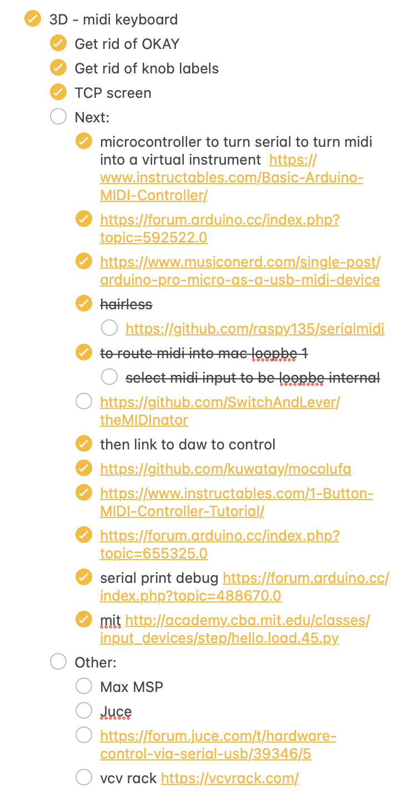
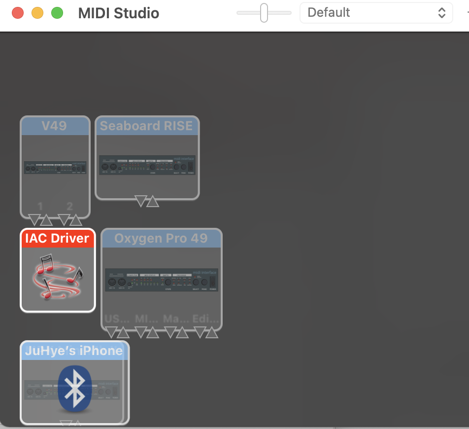
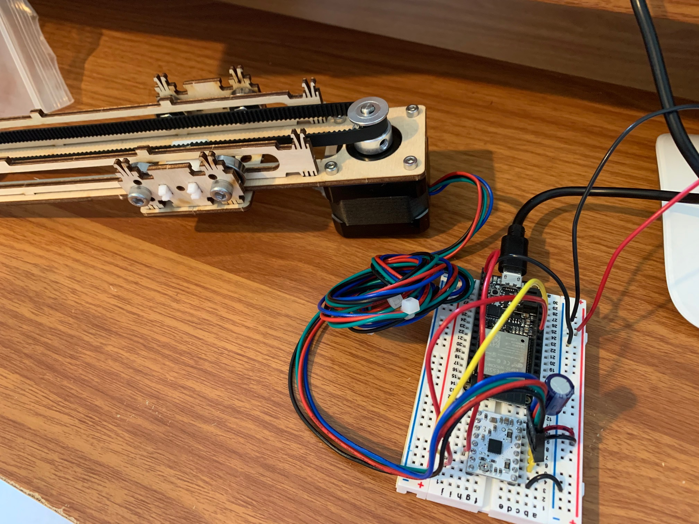

## Week 10

## Final project

This week, I worked a lot on my final project. My final project idea is to create a midi keyboard that can be controlled from different software that allows you to create music, so Digital Audio Workstations.
First, in terms of the physical aspect of my product, I needed to think about how I want to implement input. There were different ideas I had, including buttons and copper tape as well as a potentiometer. I plan on using a potentiometer to represent paraneter input. One simple example of this is to control volume. For the keys of the keyboard, since I would need at least an octave (12 keys) that are also flexible and workable with, I decided so far that the best way to do this would be with copper tape. I looked back on the week on capacitance, where we used copper tape, and believe I can make a similar set up where I have one piece of copper tape and another piece that the key would touch when you press it.

Here was my TODO list that I made for the week for final project next-steps.


Before I worked on all of these elements, however, I needed to work on the software side as well. In order to do that and to make sure that this idea would work, I set up a simple button control ciruit. 
Because I wanted to avoid buying more parts including midi input and midi wires, I researched how I could use alternative ways to do this project. I found a few blogs that used "Hairless MIDI" which is a software that allowed access to the Arduino serial monitor and converted the data to midi. Unfortunately, it turns out that Hairless midi stopped working on the new Mac OS!! This was extrememely disappointing. However, I found a github repository that created a python version of Hairless midi. It was just one man who wrote this up, and there was little documentation. 

The code for this is quite long.
``` py
import time
import queue
import rtmidi
import serial
import threading
import logging
import sys
import time
import argparse

# Serial MIDI Bridge
# Ryan Kojima


parser = argparse.ArgumentParser(description = "Serial MIDI bridge")

parser.add_argument("--serial_name", type=str, required = True, help = "Serial port name. Required")
parser.add_argument("--baud", type=int, default=115200, help = "baud rate. Default is 115200")
parser.add_argument("--midi_in_name", type=str, default = "IAC Bus 1")
parser.add_argument("--midi_out_name", type=str, default = "IAC Bus 2")
parser.add_argument("--debug", action = "store_true", help = "Print incoming / outgoing MIDI signals")

args = parser.parse_args()

thread_running = True

# Arguments
serial_port_name = args.serial_name #'/dev/cu.SLAB_USBtoUART'
serial_baud = args.baud
given_port_name_in = args.midi_in_name #"IAC Bus 1"
given_port_name_out = args.midi_out_name #"IAC Bus 2"

if args.debug:
    logging.basicConfig(level = logging.DEBUG)
else:
    logging.basicConfig(level = logging.INFO)

midi_ready = False
midiin_message_queue = queue.Queue()
midiout_message_queue = queue.Queue()

def get_midi_length(message):
    if len(message) == 0:
        return 100
    opcode = message[0]
    if opcode >= 0xf4:
        return 1
    if opcode in [ 0xf1, 0xf3 ]:
        return 2
    if opcode == 0xf2:
        return 3
    if opcode == 0xf0:
        if message[-1] == 0xf7:
            return len(message)

    opcode = opcode & 0xf0
    if opcode in [ 0x80, 0x90, 0xa0, 0xb0, 0xe0 ]:
        return 3
    if opcode in [ 0xc0, 0xd0 ]:
        return 2

    return 100

def serial_writer():
    while midi_ready == False:
        time.sleep(0.1)
    while thread_running:
        try:
            message = midiin_message_queue.get(timeout=0.4)
        except queue.Empty:
            continue
        logging.debug(message)
        value = bytearray(message)
        ser.write(value)

def serial_watcher():
    receiving_message = []
    running_status = 0

    while midi_ready == False:
        time.sleep(0.1)

    while thread_running:
        data = ser.read()
        if data:
            for elem in data:
                receiving_message.append(elem)
            #Running status
            if len(receiving_message) == 1:
                if (receiving_message[0]&0xf0) != 0:
                    running_status = receiving_message[0]
                else:
                    receiving_message = [ running_status, receiving_message[0] ]

            message_length = get_midi_length(receiving_message)
            if message_length <= len(receiving_message):
                logging.debug(receiving_message)
                midiout_message_queue.put(receiving_message)
                receiving_message = []


class midi_input_handler(object):
    def __init__(self, port):
        self.port = port
        self._wallclock = time.time()

    def __call__(self, event, data=None):
        message, deltatime = event
        self._wallclock += deltatime
        #logging.debug("[%s] @%0.6f %r" % (self.port, self._wallclock, message))
        midiin_message_queue.put(message)


def midi_watcher():
    global midi_ready, thread_running

    midiin = rtmidi.MidiIn()
    midiout = rtmidi.MidiOut()
    available_ports_out = midiout.get_ports()
    available_ports_in = midiin.get_ports()
    logging.info("IN : '" + "','".join(available_ports_in) + "'")
    logging.info("OUT : '" + "','".join(available_ports_out) + "'")
    logging.info("Hit ctrl-c to exit")

    port_index_in = -1
    port_index_out = -1
    for i, s in enumerate(available_ports_in):
        if given_port_name_in in s:
            port_index_in = i
    for i, s in enumerate(available_ports_out):
        if given_port_name_out in s:
            port_index_out = i

    if port_index_in == -1:
        print("MIDI IN Device name is incorrect. Please use listed device name.")
    if port_index_out == -1:
        print("MIDI OUT Device name is incorrect. Please use listed device name.")
    if port_index_in == -1 or port_index_out == -1:
        thread_running = False
        midi_ready = True
        sys.exit()

    midiout.open_port(port_index_out)
    in_port_name = midiin.open_port(port_index_in)

    midi_ready = True

    midiin.ignore_types(sysex = False, timing = False, active_sense = False)
    midiin.set_callback(midi_input_handler(in_port_name))

    while thread_running:
        try:
            message = midiout_message_queue.get(timeout = 0.4)
        except queue.Empty:
            continue
        midiout.send_message(message)


try:
    ser = serial.Serial(serial_port_name,serial_baud)
    ser.setDTR()
except serial.serialutil.SerialException:
    print("Serial port opening error.")
    midi_watcher()
    sys.exit()

ser.timeout = 0.4

s_watcher = threading.Thread(target = serial_watcher)
s_writer = threading.Thread(target = serial_writer)
m_watcher = threading.Thread(target = midi_watcher)

s_watcher.start()
s_writer.start()
m_watcher.start()

#Ctrl-C handler
try:
    while True:
        time.sleep(1)
except KeyboardInterrupt:
    print("Terminating.")
    thread_running = False
    sys.exit(0)

```

In order for this software to work and to communicate between the DAW as well as the serial monitor for my Metro, I had to create new IAP audio inputs and outputs. These are busses that allow for the audio to be channeled later in the DAW. 



I had some trouble getting this to work, however. I kept getting the error that my serial port was unable to open. 


After trying different debugging methods, such as looking at the code carefully, checking serial monitor output, and other possible issues, I learned from Professor Melenbrink that the issue is that I can't have the serial monitor open in two places (so when the program runs, that counts), which I was reminded of. Then, I plugged my midi button circuit as input to my DAW, Logic Pro, and here is the result!



Finally, I also modified a keyboard design that I found on thingiverse. Nathan helped me with this as well!


## Stepper Motor

During lab, I finished up making my set up for the stepper motor machine design from class. Then, I later hooked it up to the circuit and uploaded the code from class. Unfortunately, when this happened, there was a burning smell that started to come from the machine, and the connection between the breadboard and the power source became incredibly hot.



I had attached this stuffed animal to the rig with some wired hangers, and fortified it with some more tape. I tried to emultate a set up that I did weeks back with my bird that would twirl around. It was a bit too large for the rig, but I taped it to a greek yogurt lid. I wanted to add a button that would control the speed of the stepper motor, so that it would almost emulate a roller coaster ride for the plushie. This would be better than my twirly bird!


I worked on the software component of this assignment, and first did a first pass at taking in a button as input and reading it in to control whether the stepper motor would run or not. The last if statement makes sure that the stepper motor only runs while the button is pressed. Here is my modified code:

``` cpp
#include <AccelStepper.h>

const int stepPin = 13;  // blue
const int dirPin = 12;   // orange
int buttonPin1 = 2;  // still need to collab with board

// Define a stepper and the pins it will use
AccelStepper stepper(1, stepPin, dirPin); // initialise accelstepper for a two wire board

void setup()
{
  pinMode(buttonPin1, INPUT);
}

void loop()
{
  currentState = digitalRead(buttonPin1);
  if (stepper.distanceToGo() == 0)
  {
    // Random change to speed, position and acceleration
    // Make sure we dont get 0 speed or accelerations
    delay(1000);
    stepper.moveTo(rand() % 1000);
    stepper.setMaxSpeed((rand() % 1000) + 1);
    stepper.setAcceleration((rand() % 1000) + 1);
  }
  if(currentState ==  HIGH) {
      stepper.run();
    }
  
}
```

I also did research on what I could use a stepper motor to try to integrate it into some final project ideas.
I found a project that used [stepper motors and midi as well](https://create.arduino.cc/projecthub/JonJonKayne/arduino-midi-stepper-synth-d291ae). However, it seemed to use midi as INPUT instead of OUTPUT like I've been working on, and it used midi pins, so I decided to table this for now.

#### Update
Motor works! The issue was that one of my voltage wires was accidently connected to ground instead.

Here it is in action!
