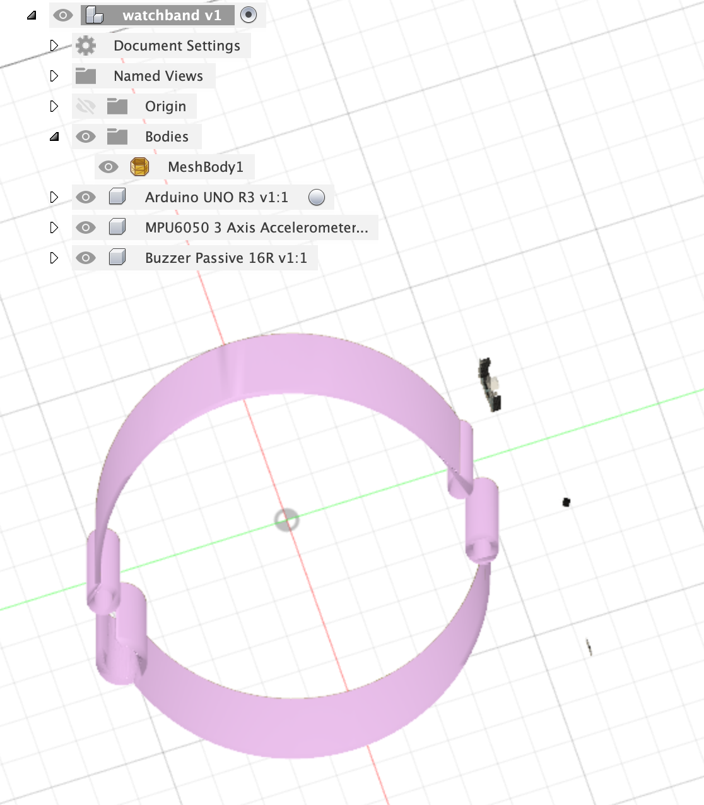
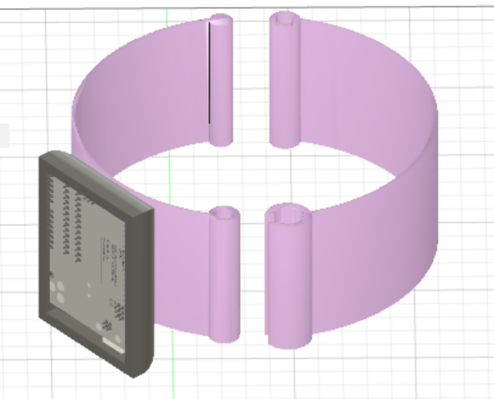

## Week 5: 3D

This week, I started an motion sensored alarm watch model.

#### Fusion 360

This model is inspired by the Apple Watch wrist band that [ibudman!](https://www.thingiverse.com/thing:87132) created.

Here, I used components from the PS70 kit, and imported them into my watch file through the insert function in Fusion 360. 
I used the Arduino microcontroller, piezo buzzer, battery 5V, and the accelerometer gyroscope. 
The microcontroller would hold the program that would play the buzzer while the gyroscope was not detecting movement. The alarm stops playing when the accelerometer detects motion, because that would indicate that the wearer got out of bed.

I first created a casing for the microcontroller so that it would be protected. I then filleted this casing and attached it to the watch.
This is a work in progress.

