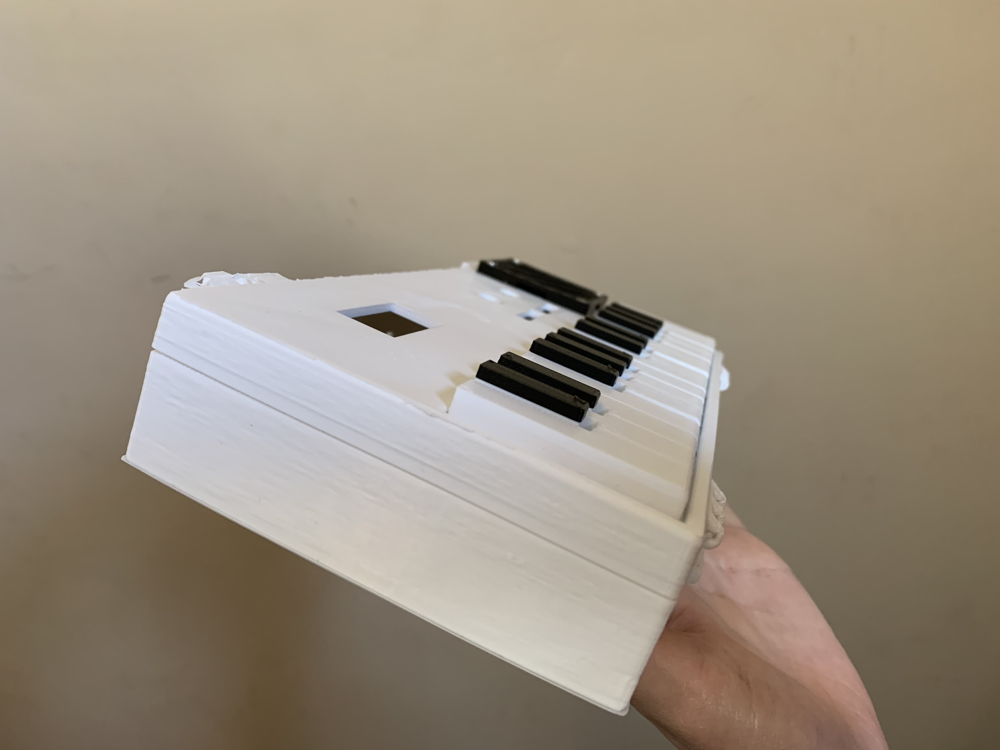

## Week 5: 3D

This week, I started an motion sensored alarm watch model.

#### Fusion 360

This model is inspired by the Apple Watch wrist band that [ibudman!](https://www.thingiverse.com/thing:87132) created.

Here, I used components from the PS70 kit, and imported them into my watch file through the insert function in Fusion 360. 
I used the Arduino microcontroller, piezo buzzer, battery 5V, and the accelerometer gyroscope. 
The microcontroller would hold the program that would play the buzzer while the gyroscope was not detecting movement. The alarm stops playing when the accelerometer detects motion, because that would indicate that the wearer got out of bed.

I first created a casing for the microcontroller so that it would be protected. I then filleted this casing and attached it to the watch.
This is a work in progress.

## 3D Keyboard

I also edited a 3D model of a mini piano-keyboard. I took original files from thingiverse and edited them in Fusion 360. The first thing I did was to smooth out the bottom of the casing, where there were originally an indented writing. I then edited (with the help of Professor Melenbrink) the top file to smooth out the logos and to cut out a space for a potential TFT display. 

There were multiple roadblocks when it came to editing the files, in particular the top file. First, the mesh body had so many vectors in it that it was near impossible to clear all of them without also influencing the other components of the model.

I tried converting the mesh body to a solid Brep form in Fusion. Then, I created a sketch and deleted structures that would make up the label. I then . After this, I extruded from the sketch and finally, used the combine function to make one solid block. Then, I cut out a rectangular window that I measured to be the size of a TFT display, which was a 32 horizontal x 16 vertical mm rectangle, using the extrude function.

Despite these changes, the files still looked rough. Thankfully, Professor Melenbrink helped out and I was able to get a much smoother version!

Here are the [STL files to download](pianostls.zip). 

This is what they looked like after assembly.

