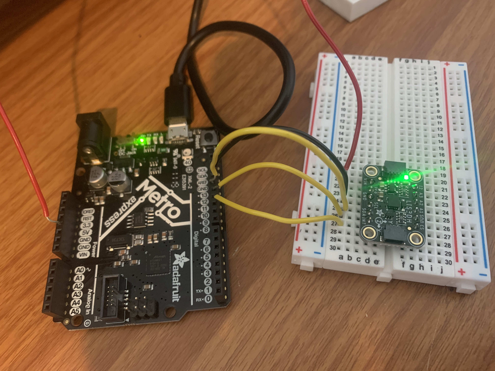
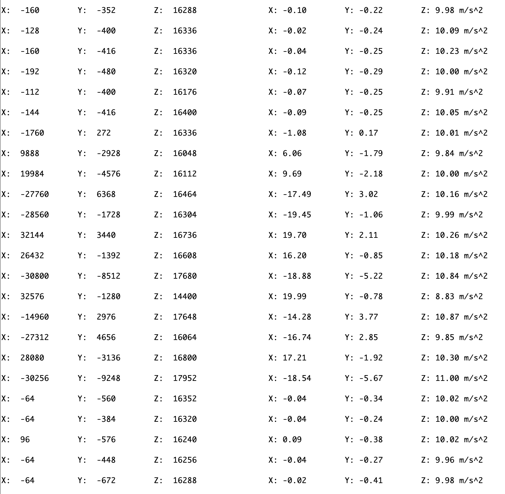
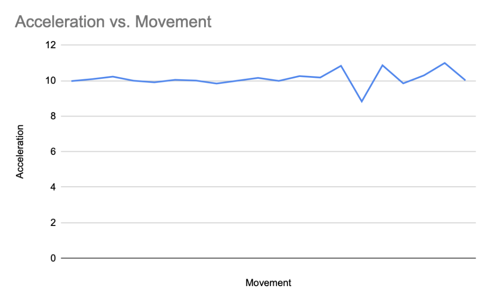
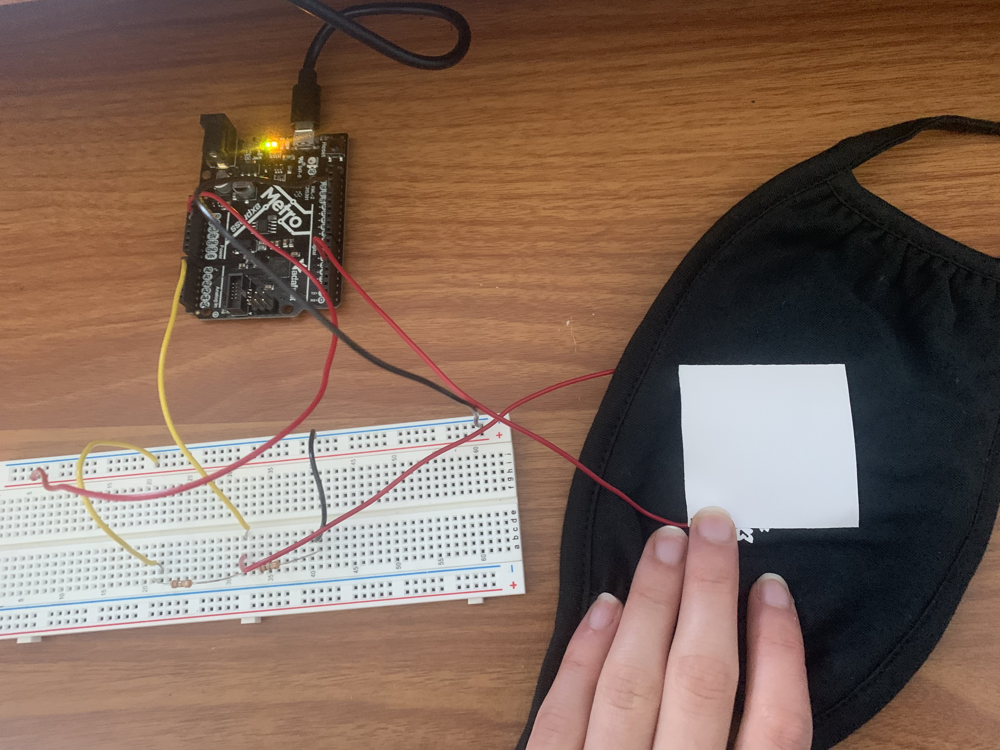
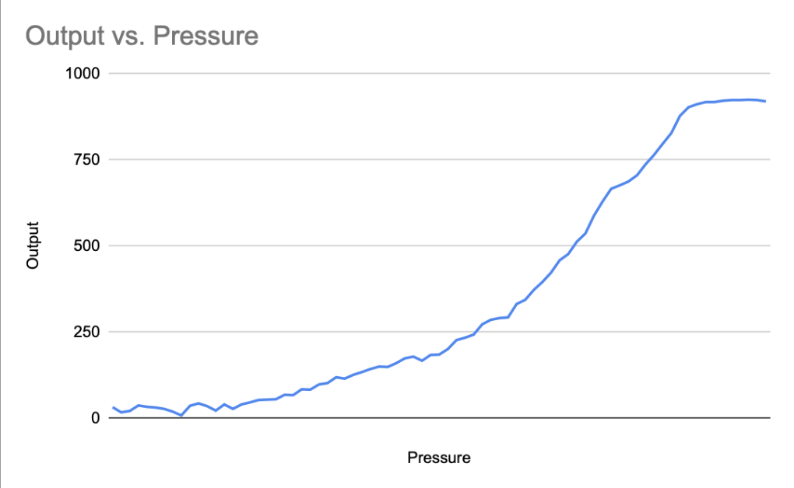

## Week 6: Sensors

This week, I used an accelerometer to measure the XYZ location and the acceration of my breadboard!

#### Materials
I used the M0 Metro Circuit from Adafruit, and an Adafruit lis3dh accelerometer from the ps70 kit.

I followed along this [Adafruit Guide!](https://learn.adafruit.com/adafruit-lis3dh-triple-axis-accelerometer-breakout/arduino) at first in order to gain a better understanding of how this sensor works.

#### How It Works

The Adafruit LIS3DH triple-Axis Accelerometer Breakout has three axis sensing. The senor communicates both through l2C or SPI, for hardware and software control. l2C works with 2 wires, the Serial Clock (SCL) and Serial Data (SDA).

I connected Vin to the power supple of 5V, the ground pin to ground, the SCL (SCK) pin to Digital #13, the SDO pin to Digital #12, the SDA (SDI) to Digital pin #11, and the CS pin to Digital #10. 

The CS pin is the chip select pin, which is a command pin that connects the I/O pins on the accelerometer to the internal circuitry .. something to learn more about!

#### Code
I got the initial code from the Adafruit acceleration example! I had to download a few libraries in order to get there.

#### Calibrating
I wasn't actually sure how to calibrate this accelerometer. I played around with the accelerometer to move it back and forth and different speeds. As I move it back and forth, I suspected that the faster I move it, the more acceleration there would be, especially during my "turning points" when I switch from moving it one direction to another.

<!--  -->


However, I don't think this was the best way of testing, as I didn't get much of a takeaway result. It might be that the m/s^2 is too large of a unit.

Another issue I wondered about is why the acceleration was still around 9.8 m/s^s when sitting absolutely still on my desk. Is it possible that the LIS3DH is also measuring the gravitational pull of the Earth? Or is this just a coincidence? I might have to look more into how it works! At first I thought it might be in the code (as a default acceleration that it sets), but I couldn't parse something that seemed to indicate this.

Here's the original data:
<!--  -->

This is in the serial moniter, and the data shows us the XYZ data. As you can see, as the accelrmoter is still, these values are near 0.

And here's the graph:

#### Capacitative sensor
A Mask! From class

#### Graph
As the pressure increases (aka, as the sensors are closer together), the more output!
