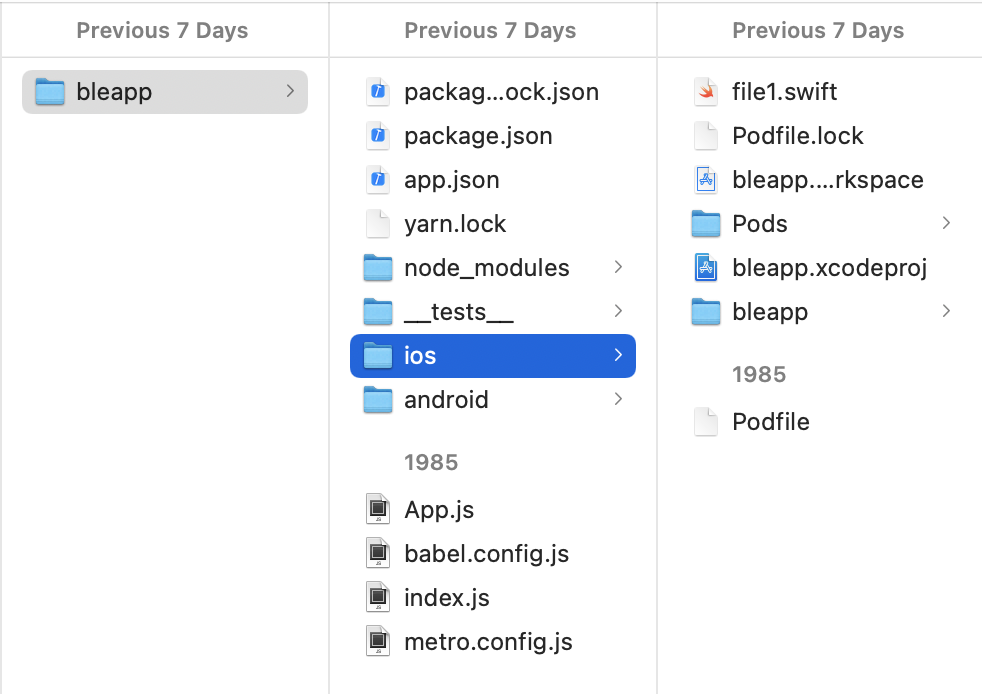

## Week 9

## BLE: LED on/off control

This week, I programmed my Huzzah board to respond to a BLE connection. I downloaded the [BLE Scanner app](https://play.google.com/store/apps/details?id=com.macdom.ble.blescanner&hl=en_US) by Bluepixel Technologies onto my iPhone.

Here's what the product looked like:


Here's my code as a code snippet. (Code snippets in markdown can be embedded with 3 backward ticks):

```cpp

/*
    Based on Neil Kolban example for IDF: https://github.com/nkolban/esp32-snippets/blob/master/cpp_utils/tests/BLE%20Tests/SampleWrite.cpp
    Ported to Arduino ESP32 by Evandro Copercini
*/

#include <BLEDevice.h>
#include <BLEUtils.h>
#include <BLEServer.h>

// See the following for generating UUIDs:
// https://www.uuidgenerator.net/

#define SERVICE_UUID        "4fafc201-1fb5-459e-8fcc-c5c9c331914b"
#define CHARACTERISTIC_UUID "beb5483e-36e1-4688-b7f5-ea07361b26a8"

int LED_PIN = 5;
char LED_STATUS;

class MyCallbacks: public BLECharacteristicCallbacks {
    void onWrite(BLECharacteristic *pCharacteristic) {
      std::string value = pCharacteristic->getValue();
      if (value.length() > 0) { 
        for (int i = 0; i < value.length(); i++){
          LED_STATUS = value[i];
        }
      }
    }
};

void setup() {
  Serial.begin(115200);
  BLEDevice::init("JuHye_ESP32");
  BLEServer *pServer = BLEDevice::createServer();

  BLEService *pService = pServer->createService(SERVICE_UUID);

  BLECharacteristic *pCharacteristic = pService->createCharacteristic(
                                         CHARACTERISTIC_UUID,
                                         BLECharacteristic::PROPERTY_READ |
                                         BLECharacteristic::PROPERTY_WRITE
                                       );

  pCharacteristic->setCallbacks(new MyCallbacks());

  pCharacteristic->setValue("Hello World");
  pService->start();

  BLEAdvertising *pAdvertising = pServer->getAdvertising();
  pAdvertising->start();
  
  pinMode(LED_PIN, OUTPUT);
  digitalWrite(LED_PIN, LOW);
}

void loop() {
  int val = (int)LED_STATUS;  // cast the char* as an int 
  if (val == 49)              // ASCII code for the number 1
    digitalWrite(LED_PIN, HIGH);
  else 
    digitalWrite(LED_PIN, LOW);

  delay(2000);
}
```

BLE Scanner App instructions


## Custom Bluetooth app

React native is a cross-platform mobile application framework using JavaScript that was created by Facebook. It is widely used in app development. You can install react native component libraries, which helps you integrate different functions into your app. I decided to try this out, since I wanted to start creating an app that could work on both Android and iOS.
In order to incorporate BLE functionality, I installed the react-native-ble-plx library from [Polidea's GitHub Repository](https://github.com/Polidea/react-native-ble-plx). I followed along with the set up, which took a really long time because I kept getting many errors when trying to update my PodFile, which is a file that describes the dependencies of XCode targets. (All lingo I was unfamiliar with).




Ultimately, I was not able to implement anything substantial, but at least I got the initial setup running! Xcode also kept crashing, unfortunately :( 

## Radio communication: Huzzah and ESP32 Cam

For this project, I demonstrated radio serial communication between my Huzzah Board and my ESP32 Cam. One major issue I kept having was accidently getting my two boards mixed up. So, I renamed the files to directly say "this one is the one to be uploaded to the Huzzah" and vice versa, and only had one board connected at a time so I don't get ports confused! Here's a demonstration of successful radio communication in the serial monitor! For next time, I want to integrate other output devices.
