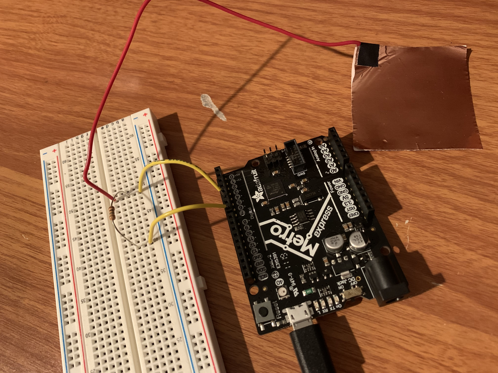

## Week 11

## Color Tracking Web cam!

This week, I decided to tackle working with the ESP32 Cam and colortrack with OpenCV.js. Important notes included engaging the reset button onboard while connecting, and disconnecting the ground and GPIO pins after uploading the code. Once I had the program and board set up and working, it was time to manipulate the OpenCV application! It was difficult at first to set a good mask to track my blue-colored object. I used part of a switch controller to track, because it was a bright blue. To help be figure out the settings for the RGB values, I used this [RGB Color Picker](https://www.rapidtables.com/web/color/RGB_Color.html). Though it took a while, ultimately, the colortracking worked! 



## Capacitive Touch Midi Controller

I wrote custom code to measure capacitive touch and turn that data into midi data to use in a DAW! 
First, I set up my circuit like so (this is something we went over in earlier weeks):



The idea was that when the sensor outputs beyond a certain threshold, a midi note would be sent as output. When the capacitive sensor is below a certain threshold, the midi note is no longer playing. The capacitive sensor has more flexibility and versatility than the button midi circuit I built last week. This is because copper tape capacitive sensoring is not a binary, but is a function of how much resistance I am putting on the tape! Because of this, I could control velocity of my midi output. (note: velocity in the context of MIDI is a synonym to loudness). I also accounted for this in my code. 127 represents the loudest a midi note can be tagged for. 0 is the smallest. My approach was to first test the range of numbers outputted by the capacitive sensor, and wrote in threshold values according to what was reasonable. For the current setup, I decided to use 40000 as the high threshold, 20000 as a medium threshold, and 1000 as a low threshold. These would in turn represent high, low, and medium velocities, respectfully. These numbers were set to variables so that the threshold values can be easily manipulated based on the sensor sensitivity.

``` cpp
#include <CapacitiveSensor.h>

CapacitiveSensor Sensor = CapacitiveSensor(7,5);  // 7 is charge pin.  5 is sense pin.
byte noteON = 144; //note on command

long currentState = 0;
long lastState = 0;

void setup(){
  Serial.begin(115200); //initialize Serial connection
}
void loop(){
  long sensorValue = Sensor.capacitiveSensor(1000);
  long high = 40000;
  long med = 20000;
  long low = 1000;
  currentState = sensorValue;
  if (currentState > high  && lastState < low){
    MIDImessage(noteON, 60, 127); //turn note 60 on with 127 velocity
    delay(200); // Debounce
  if (currentState > med  && (lastState < low){
    MIDImessage(noteON, 60, 80); //turn note 60 on with 127 velocity
    delay(200); // Debounce
  } else if(currentState <= high  && lastState >= low){
    MIDImessage(noteON, 60, 0); //turn note 60 off
    delay(20);
  }
  lastState = currentState;

//  Serial.println(sensorValue); // Debugging
 
}
//send MIDI message
void MIDImessage(byte command, byte data1, byte data2) {
  Serial.write(command);
  Serial.write(data1);
  Serial.write(data2);
}
```
The serial midi program I ran is the same code as last week's. You can find it [here, in week 10](https://juhye-m.github.io/ps70/posts/week-10/).

My circuit and baseline code works. I can test the output values by printing the sensor values to the serial monitor. I ran the serial to midi converter, and hooked it up to my Macbook audio input bus. I then opened my DAW, and it almost works!



However, for some reason, this midi data doesn't "save", nor does it produce sound. However, it is clearly detecting the midi notes. I have yet to debug this.

## Miscellaneous

I wanted to make my terminal more visible when recording a demo video and was planning on switching to "dark mode". Turns out, you can customize the mac terminals even more! Here's my custom terminal inspired by an artist I like.

