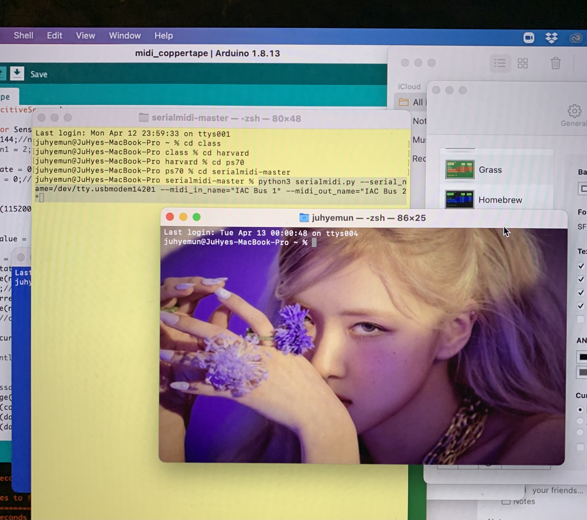

## Week 11

## Color Tracking Web cam!

Made with OpenCV.js.



## Capacitive Touch Midi Controller

I wrote custom code to measure capacitive touch and turn that data into midi data to use in a DAW! 

``` cpp
#include <CapacitiveSensor.h>

CapacitiveSensor Sensor = CapacitiveSensor(7,5);  // 7 is charge pin.  5 is sense pin.
byte noteON = 144; //note on command

long currentState = 0;
long lastState = 0;

void setup(){
  Serial.begin(115200); //initialize Serial connection
}
void loop(){
  long sensorValue = Sensor.capacitiveSensor(1000);

  currentState = sensorValue;
  if (currentState > 40000  && lastState < 1000){
    MIDImessage(noteON, 60, 127); //turn note 60 on with 127 velocity
    delay(200); // Debounce
  } else if(currentState <= 40000  && lastState >= 1000){
    MIDImessage(noteON, 60, 0); //turn note 60 off
    delay(20);
  }
  lastState = currentState;

//  Serial.println(sensorValue); // Debugging
 
}
//send MIDI message
void MIDImessage(byte command, byte data1, byte data2) {
  Serial.write(command);
  Serial.write(data1);
  Serial.write(data2);
}
```
The serial midi program I ran is the same code as last week's.

My circuit and baseline code works. I can test the output values by printing the sensor values to the serial monitor. I ran the serial to midi converter, and hooked it up to my Macbook audio input bus. I then opened my DAW, and it almost works!



## Miscellaneous

I wanted to make my terminal more visible when recording a demo video and was planning on switching to "dark mode". Turns out, you can customize the mac terminals even more! Here's my custom terminal inspired by an artist I like.

