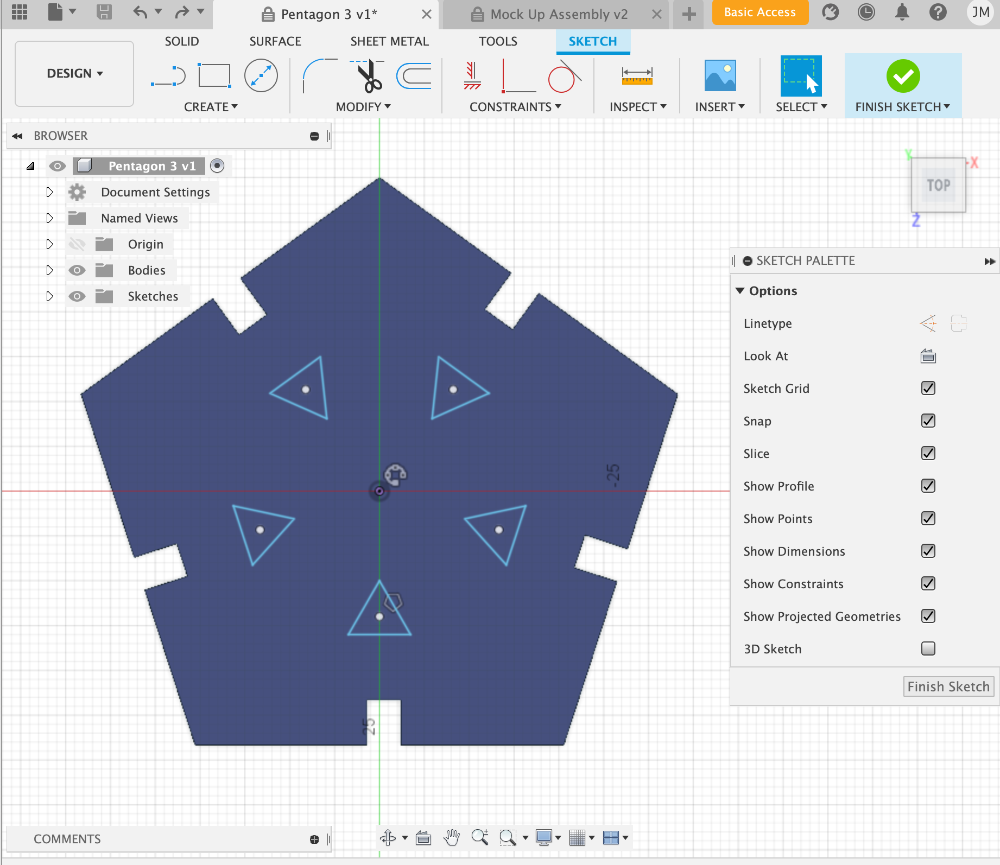
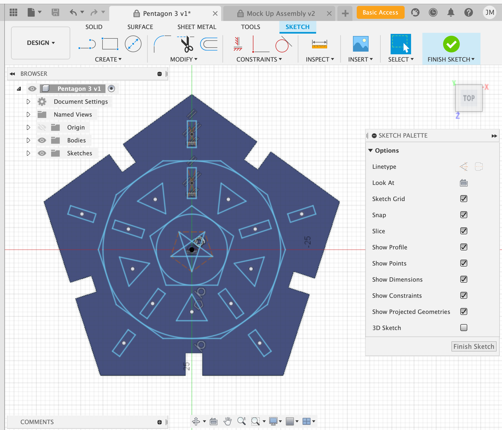
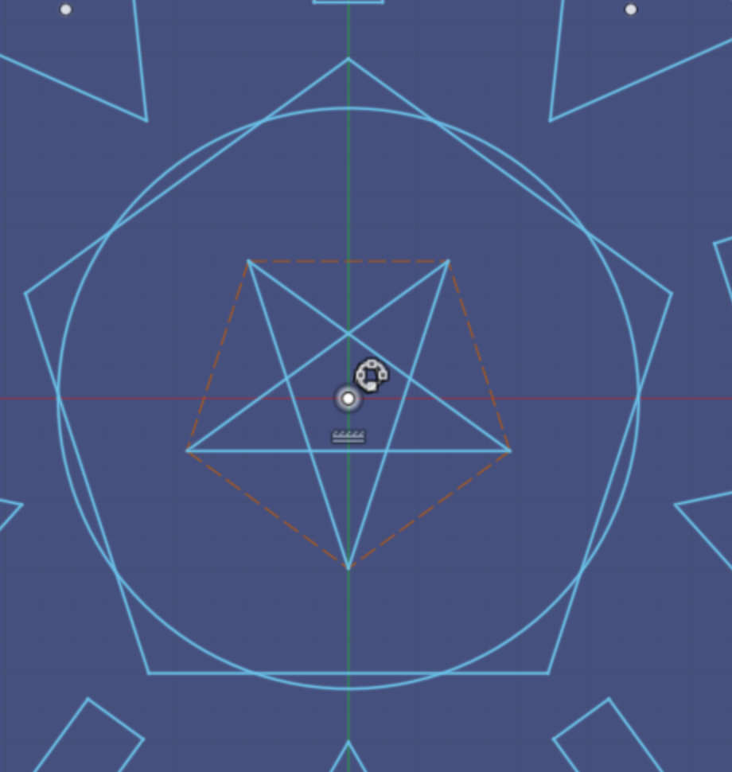
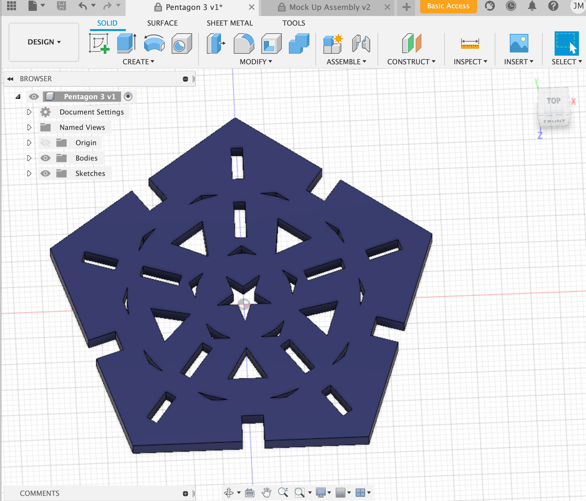

## Press Fit Construction Kit

For this assignment, I collaborated with Hugh and Amy to create a cardboard press-fit kit for lampshades.
I got this idea from a beautiful wooden lamp that I had seen on the internet:

I realized that none of us were artists, and so we decided to create geometric patterns that would create a "starlight" effect over a lightbulb, like these:

 

First, I started by creating a sketch of a pentagon. 
 
I drew one triangle using the draw polygon function in Fusion 360. I then replicated this triangle through the circular pattern tool, which proved to be very useful. I then added more shapes, such as another innder pentagon, circles, and rectangles. Then the final touch was a star!
 

After I finished my initial sketch, I decided to go ahead and extrude the patterns to move forward with my lampshade design.
 
However, after cutting out the pieces, I realized that because the inner circles were the same diameter as the pentagons, there was no support between the two shapes and the component would fall apart once cut out on cardboard. 

So, I decided to re-do the inner pentagon and circles to over lap each other -- meaning, the circle's diameter would be larger than the pentagon's by just a hair.

 

TADA! Here is my finished product:
 

## 3D Modeling Real-life

This next exercise was to model components found in our physical kit for PS70. I chose to first recreate this breadboard:

The first step was the take measurements using my calibrator. I charted these onto a piece of graph paper.

After taking proper measurements, I took to Fusion 360 once more. 
First, I created another sketch of my breadboard. The most difficult part of this project was to get the rows and columns properly aligned. I had to make a lot of use of the mirroring function.

I added construction lines and a construction square box around the top and bottom circles in order to keep my lines and shapes clean and aligned.
However, the issue was that because of slight imperfections in my measuring of the real breadboard, there was an extra millimeter of spave at the bottom of the grids that was unintentional.

I must go and redo these measurements, or "predict" the measurements with math so that the breadboard is symmetrical. The next step then would be to re-extrude the components and add the sides pieces together as well!