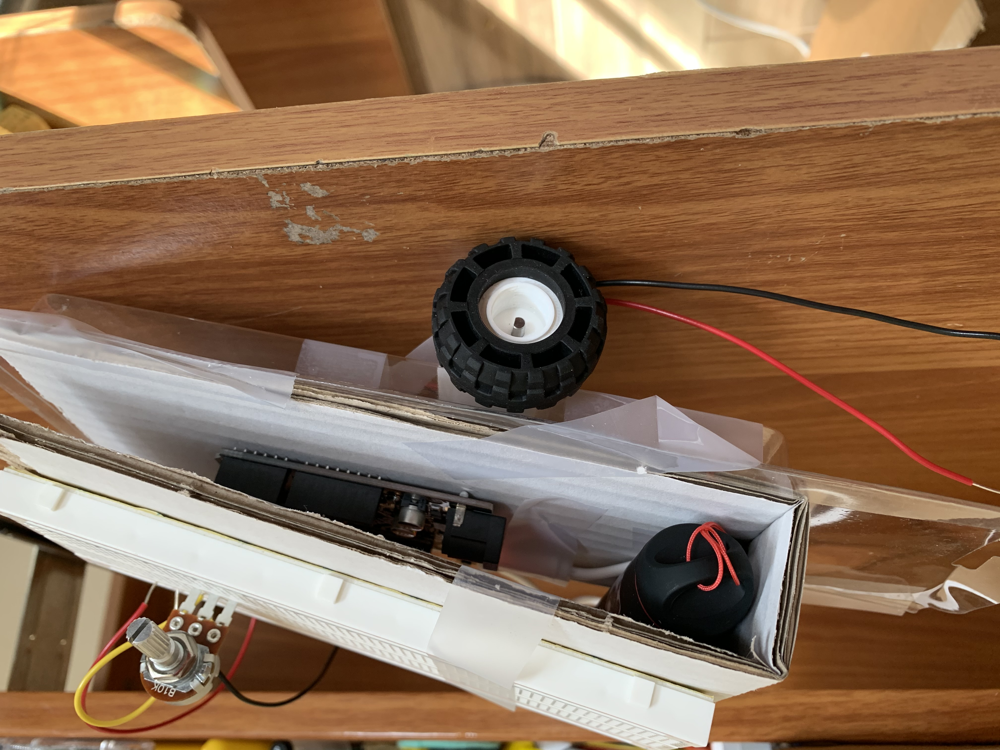

## Week 3: Kinetic Sculpture

This week, I created a Valentine's day themed rotating bird as a kinetic sculpture. This was definitely a journey -- it evolved into something much more fun that I anticipated!

#### Materials
I used the M0 Metro Circuit from Adafruit, a potentiometer, a moter, and the breadboard from the PS 70 kit to start. 
Circuit inspired by class:


Attached the motor to the lego wheels and 3D printed structures from the hardware packet. 


I quickly realized I needed to plant the wheels on a structure that allowed for the wheels to turn freely. 
I didn't have many materials around the house, but I realized that the plastic packaging that our wire clippers came in happened to be a (almost) perfect size! So I mounted the wheels onto the piece of scrap plastic like so.


Then, I taped the entire project onto a piece of scrap cardboard, with the breadboard on top, the circuit and a USB power source in the middle, and the motors/wheels at the bottom.




The code that I used for this project is similar to the one from class:
```cpp

const int A1A = 3;  // define pin 3 for A-1A (PWM Speed)
const int A1B = 4;  // define pin 4 for A-1B (direction)

void setup() {
  pinMode(A1A, OUTPUT);     // specify these pins as outputs
  pinMode(A1B, OUTPUT);
  digitalWrite(A1A, LOW);   // start with the motors off 
  digitalWrite(A1B, LOW);
}

void loop() {
  // start the motor 
  digitalWrite(A1A, HIGH);   
  digitalWrite(A1B, LOW);
  delay(4000);              // allow the motor to run for 4 seconds

  // stop the motor
  digitalWrite(A1A, LOW);   // setting both pins LOW stops the motor 
  digitalWrite(A1B, LOW);   // redundant, but doesn't hurt 
  delay(2000);              // keep the motor off for 2 seconds

}
``` 

#### Testing the base and kinetic component!
Originally, I intended to make a moving board, like a robot that just goes straight. However, after testing the board, it just kept running in circles! I then assumed that part of the issue was that the board was imbalanced.




However, after re-taping and measuring, I was stilll unable to make the object move in a straight line. I then decided to make the most of what I had, and had the idea to make a stationary sculpture that revolved.

I got an old wired hanger from my roommate's closet, ant bent it into an antennae-like object, then attached the lid of a Greek Yogurt bin and some scrap cardboard (from the hanger). 


Originally, I wanted to make a fan, but it was both lopsided and not too pretty! So I added some wings from tissue paper from a box of chocolate that my mom sent me for Valentine's day.


#### And... VOILA!


It's a bit cursed. Here's a meme:


Make your own!


<!-- https://youtu.be/dcrF8g68u-k -->