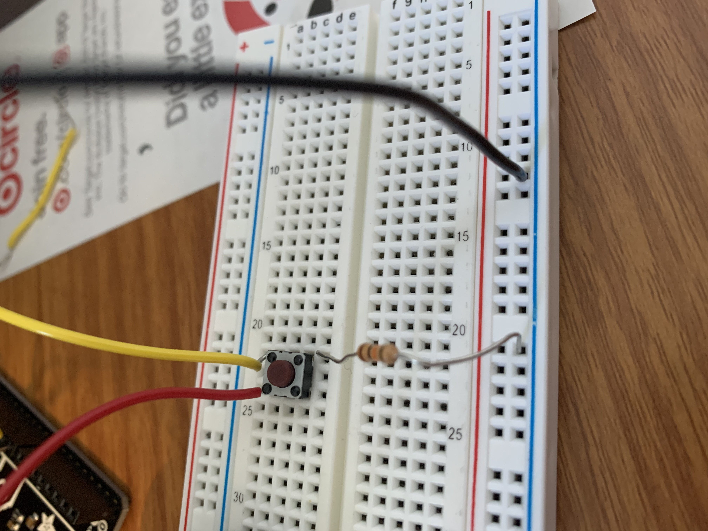
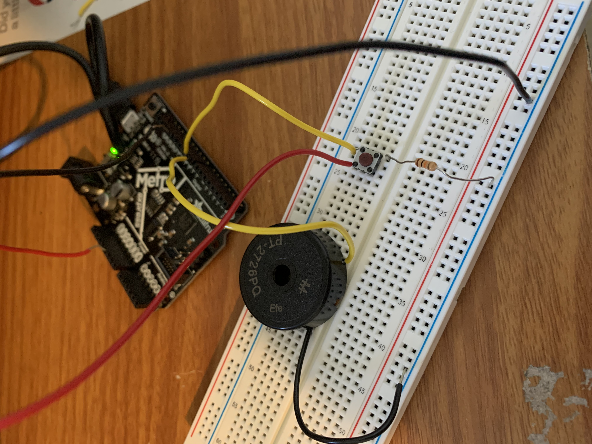
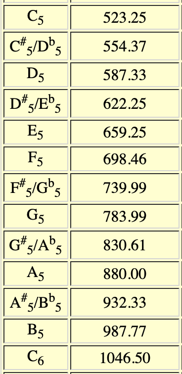

## Week 4: Microcontroller Programming

This week, I created a simple button-controlled music player!

#### Materials
I used the M0 Metro Circuit from Adafruit, a piezo speaker, a button, and the breadboard from the PS 70 kit to start. 

I first used the button circuit from class as inspiration. I attached a button and a resistor from ground to one of its legs. Then I connected this leg to digital input 8 so that I can program the button's functionality. Finally I ran 5 volts to the other leg of the button. 



Then, I hooked up the piezo speaker! I connected the - leg to ground and the + leg to digital pin 9 to upload instructions to the piezo.



<!-- What this does is it  -->

#### Code
I got the initial code for the music from this [Adafruit Guide!](https://learn.adafruit.com/experimenters-guide-for-metro/circ06-code)

```cpp
// CIRC06 - Music with Piezo
  
int speakerPin = 9;
int length = 15; // the number of notes
char notes[] = "ccggaagffeeddc "; // a space represents a rest
int beats[] = { 1, 1, 1, 1, 1, 1, 2, 1, 1, 1, 1, 1, 1, 2, 4 };
int tempo = 300;
 
void playNote(char note, int duration) {
  char names[] = { 'c', 'd', 'e', 'f', 'g', 'a', 'b', 'C' };
  int tones[] = { 1915, 1700, 1519, 1432, 1275, 1136, 1014, 956 };  
  // play the tone corresponding to the note name
  for (int i = 0; i < 8; i++) {
    if (names[i] == note) {
      tone(speakerPin, tones[i], duration);
    }
  }
}
 
void setup() {
  pinMode(speakerPin, OUTPUT);
}
 
void loop() {
  for (int i = 0; i < length; i++) {
    if (notes[i] == ' ') {
      delay(beats[i] * tempo); // rest
    } else {
      playNote(notes[i], beats[i] * tempo);
    }
    
    // pause between notes
    delay(tempo / 2); 
  }
}
```

Using this as the starting point for my program, I adapted the code to play a different tune. 
I did this by changing the array of characters, notes, which is a string, from "ccggaagffeeddc " to "ccggaag ffeeddcc". Because the tones are already associated with the note names in the play note function, this is sufficient to change the notes that are played. The tones in the play note function are frequencies. 

You can learn more about the tone function in the [arduino manual](https://www.arduino.cc/reference/en/language/functions/advanced-io/tone/). The tone function takes as input a frequency, and outputs a square wave of that frequency. In the code above, we see that the tone() function takes in 3 arguments, with the latter being optional: pin, frequency, duration.

I modified the "play note" function as well, in order to shift down the tones by an octave. To get the proper frequencies for the notes, I referenced this [chart of frequencies](https://pages.mtu.edu/~suits/notefreqs.html).



Then, I rounded the frequencies to the nearest integer, because the tone function only takes as input an unsigned integer.

Here is the modified code that I wrote:


```cpp
int speakerPin = 9;
int length = 15; // the number of notes
char notes[] = "ccggaag ffeeddcc"; // a space represents a rest
int beats[] = { 1, 1, 1, 1, 1, 1, 2, 1, 1, 1, 1, 1, 1, 2, 4 };
int tempo = 300;
 
void playNote(char note, int duration) {
  char names[] = { 'c', 'd', 'e', 'f', 'g', 'a', 'b', 'C' };
  int tones[] = { 523, 587, 659, 698, 784, 880, 988, 1047 };  
  // play the tone corresponding to the note name
  for (int i = 0; i < 8; i++) {
    if (names[i] == note) {
      tone(speakerPin, tones[i], duration);
    }
  }
}
 
void setup() {
  pinMode(speakerPin, OUTPUT);
}
 
void loop() {
  for (int i = 0; i < length; i++) {
    if (notes[i] == ' ') {
      delay(beats[i] * tempo); // rest
    } else {
      playNote(notes[i], beats[i] * tempo);
    }
    
    // pause between notes
    delay(tempo / 2); 
  }
}
```

#### And... TADA!

