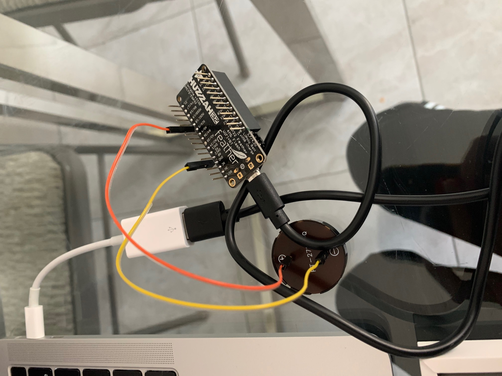

## Week 7

I had many ideas this week The first one was to create a mic-sensor controlled led output that lit up when the sound threshold past a certain point.
The other was to use the feather controller to build upon my project from a couple weeks ago with the piezo speaker and music!
Finally, for section, I created this awesome webcam.

## Mic sensor
For this project, I knew that I needed to wire up the mic and the LED with the m0 microcontroller such that the microphone was the input and the LED light was the output. My idea was to make the LED light up of the sound was past a certain DB threshold. I thought this concept could be applied to more useful projects later on, since one thing I struggle with is hearing problems (my ears are often too sensitive and they "twitch" a lot when I can't hear). It would be cool to have a device that tells me how loud the environment I'm in is! Later, I wanted to have the screen tcp output that could actually display the specific sound level measurements. But first, I wanted to test out and learn how to make the mic work with a simple LED hookup.

Here's what the product looked like:

And here was the code:

Unfortunately, the code was not working and I kept getting the error of a timeout. I have a couple hypothesis for this, and one is that the mic is not always listening. I might need to put this in a loop so that the mic is always sensing. I tried to play around with this code, but couldn't figure out how exactly to make this work. So, I decided to move on to another idea I had, which was to combine what we learned in class about a simple wifi server and try to integrate it into my earlier project with a piezo speaker that played music!

## Wifi Speaker
For this, I had to remember to change my board in the Arduino tools.

I connected the SCK 5 pin to the positive side of the spiezo and tthen ground to the negetive leg. I predicted that this would be similar to the LED controlled output from class.

Here is my circuit:

I knew that the hardest part of this would be to integrate the wifi code with the music ones that I had earlier. It was kind of difficult to understand everything that was going on with the wifi code, and I didn't realize it until I was ready to try it out! Here is what my code looks like so far (there are some comments about LED that aren't relevant here):

This is some debugging that I want to continue to do, as there were some syntax errors that weren't being nice.

## Web cam!

Finally, this is an assignment that I did during lab, after many minutes of trying to figure out what was happening with Victoria, Amy, and Erik. This is a video of how it works, and I thought it was pretty cool!

<!--  -->

