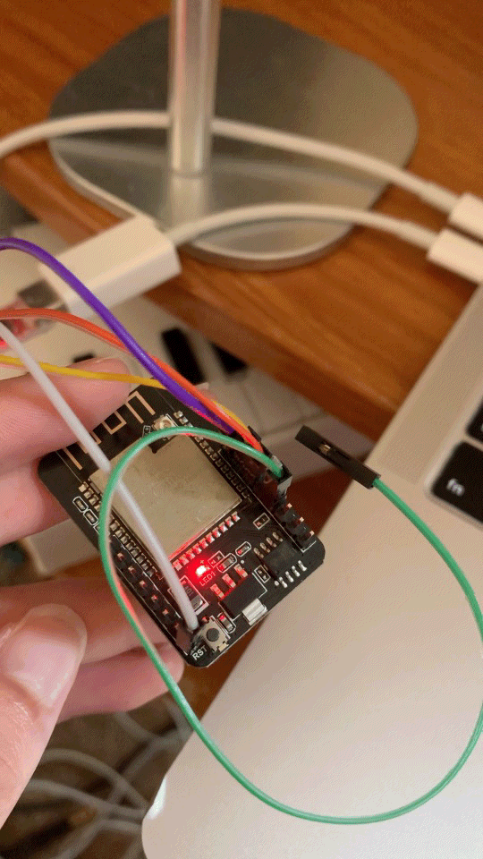

## Week 8: Radio communication

This week's asssignment was to demonstrate communication between two microcontrollers, and I chose to do this over radio communication.

## Morse Code Light

For this project, I demonstrated radio serial communication between my Huzzah Board and my ESP32 Cam.

First, I set up a simple radio communication program in order to establish the connection between the two devices and make sure that it works.

One major issue I kept having was accidently getting my two boards mixed up. So, I renamed the files to directly say "this one is the one to be uploaded to the Huzzah" and vice versa, and only had one board connected at a time so I don't get ports confused! (I actually switched these two later, after adding my inout and output devices). Here's a demonstration of successful radio communication in the serial monitor!



After getting this to work, my next step is to include an input/output device connected to each microcontroller. 

I attached a button to the huzzah and an LED to the ESP32 cam. Everytime the button is pressed, the LED will light up. The idea is to create a morse code communication portal through light, like in the movie Parasite.


The next step is to set up the button circuit on the huzzah. We want to first connect one leg of the button to a 10k resistor leading to ground. Then, we want to read to digital pin 5 from that same leg. On the other leg of the button, send 3 volts. This circuit is adapted from the basic button circuit for the metro express board in my [Week 4 documentation](https://juhye-m.github.io/ps70/posts/week4/). 

The difficult part of this step was to make sure we were reading from the correct digital pin. I needed to take the huzzah board off of the breadboard and look on its underside to make sure I was connecting to the SCK/5 pin. I would encourage you to double check, as this was a silly mistake that had stumped me for too long.

Here is the code: 
```cpp

// digital pin 5
#define BUTTON_PIN 5

void setup() {

  // set button pin as an input
  pinMode(BUTTON_PIN, INPUT);

  // serial connection
  Serial.begin(115200);
}

void loop() {

  if(digitalRead(BUTTON_PIN) == HIGH){
    Serial.println(1);
    delay(500);}
  else{
    Serial.println(0);
    delay(500);}
}
```

After fixing this, the program above worked! I can check my looking at the serial monitor and checking for the outputs 0 when not pressed and 1 when pressed.


Next, we run a simple blink program on our ESP32 cam in order to test the circuit and make sure the basic program works.
The ESP32 AI Thinker Cam has a built-in LED that is accessible digitally as pin 33, according to the [board's pinout guide](https://randomnerdtutorials.com/esp32-cam-ai-thinker-pinout/). The GPIO 33 is am on-board red LED that operates on inverted logic. That is, a LOW signal turns it on and a HIGH signal turns it off. I experimented with this on-board LED to create a simple blink program that loops.

This is my code:
```cpp
// the setup function runs once when you press reset or power the board
void setup() {
  pinMode(33, OUTPUT);
}

void loop() {
  digitalWrite(33, HIGH);   // turn the LED off
  delay(1000);                       // wait
  digitalWrite(33, LOW);    // turn the LED on
  delay(1000);
}
```

And here is the LED light on the ESP32 Cam blinking!



Finally, it's time to piece it all together!

This code is adapted from Rui Santos' project at https://RandomNerdTutorials.com/esp-now-esp32-arduino-ide/.  

#### For Huzzah transmit with button input
I integrated all of the above into the serial radio communication program. I first initialize the "myData" variable to 0. A value of 0 will represent no-light, and a value of 1 will represent LED on. 
In my setup, I set my button digital pin 5 to be able to read on/off information. Then, in the main loop where I broadcast the data with esp now send, I set "myData" to be 0 or 1 dependent on whether or not my button is pressed. The delays allow for a short button "debouncing", while still keeping lag low.

```cpp

#include <esp_now.h>
#include <WiFi.h>

// digital pin 5
#define BUTTON_PIN 5

// REPLACE WITH YOUR RECEIVER MAC Address
uint8_t broadcastAddress[] = {0xA8, 0x03, 0x2A, 0x69, 0xB9, 0xC4};

byte myData = 0; //light on or off

// callback when data is sent
void OnDataSent(const uint8_t *mac_addr, esp_now_send_status_t status) {
  Serial.print("\r\nLast Packet Send Status:\t");
  Serial.println(status == ESP_NOW_SEND_SUCCESS ? "Delivery Success" : "Delivery Fail");
}
 
void setup() {
  // set button pin as an input
  pinMode(BUTTON_PIN, INPUT);
  
  // Init Serial Monitor
  Serial.begin(115200);
 
  // Set device as a Wi-Fi Station
  WiFi.mode(WIFI_STA);

  // Init ESP-NOW
  if (esp_now_init() != ESP_OK) {
    Serial.println("Error initializing ESP-NOW");
    return;
  }

  // Once ESPNow is successfully Init, we will register for Send CB to
  // get the status of Trasnmitted packet
  esp_now_register_send_cb(OnDataSent);
  
  // Register peer
  esp_now_peer_info_t peerInfo;
  memcpy(peerInfo.peer_addr, broadcastAddress, 6);
  peerInfo.channel = 0;  
  peerInfo.encrypt = false;
  
  // Add peer        
  if (esp_now_add_peer(&peerInfo) != ESP_OK){
    Serial.println("Failed to add peer");
    return;
  }
}
 
void loop() {
  for (int i=0; i<5; i++){
//    myData++;
    if(digitalRead(BUTTON_PIN) == HIGH){
      myData = 1;
      delay(100);}
    else{
      myData = 0;
      delay(100);}
    // Send message via ESP-NOW
    esp_err_t result = esp_now_send(broadcastAddress, (uint8_t *) &myData, sizeof(myData));
     
    if (result == ESP_OK) {
      Serial.println("Sent with success");
    }
    else {
      Serial.println("Error sending the data");
    }
  }
  delay(200);
}
```


#### For ESP32 receive and output light
I then included an if/else statement that checked the value of the "myData" variable. If the data received is 1, then turn the LED on. If not, then keep it off.

```cpp
#include <esp_now.h>
#include <WiFi.h>

byte myData = 0;

// callback function that will be executed when data is received
void OnDataRecv(const uint8_t * mac, const uint8_t *incomingData, int len) {
  memcpy(&myData, incomingData, sizeof(myData));
  Serial.print("Bytes received: ");
  Serial.println(len);
  Serial.print("byte: ");
  Serial.println(myData);
  if (myData == 1) {
    digitalWrite(33, LOW);
  }
  else {
    digitalWrite(33, HIGH);
  }
  
}
 
void setup() {
  // initialize digital pin LED_BUILTIN as an output.
  pinMode(33, OUTPUT);
  
  // Initialize Serial Monitor
  Serial.begin(115200);
  
  // Set device as a Wi-Fi Station
  WiFi.mode(WIFI_STA);

  // Init ESP-NOW
  if (esp_now_init() != ESP_OK) {
    Serial.println("Error initializing ESP-NOW");
    return;
  }
  
  // Once ESPNow is successfully Init, we will register for recv CB to
  // get recv packer info
  esp_now_register_recv_cb(OnDataRecv);
}
 
void loop() {
}

```
Tada!



This project works through radio communication, so they do not have to be right next to each other, or plugged into my laptop! (though they still need a power source). Time to write morse code to my housemate asking if they can make dinner tonight!