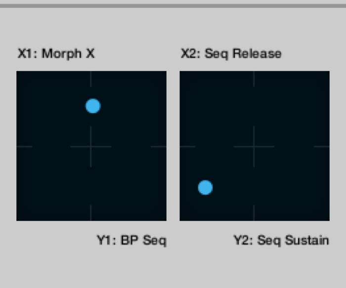
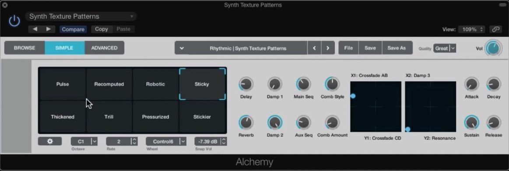
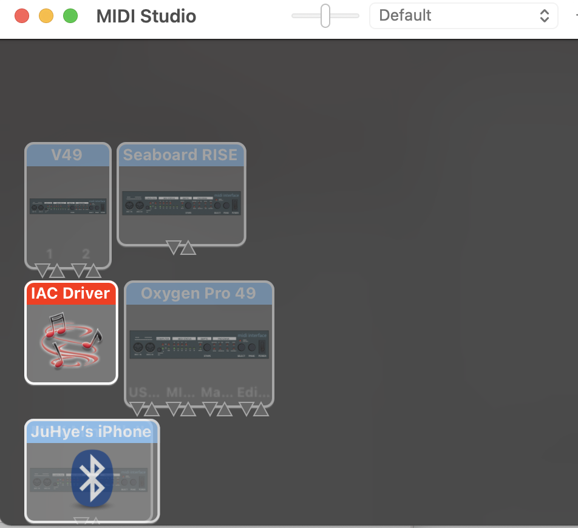

# Compilation of Working Documentation for Final Project

## Proposal

## Brainstorm/Other Ideas

#### "Hands Off" Color Tracking 3D MIDI controller with ESP32 Cam
For my final project, I aim to build a midi controller where a person can change instrument sounds just by holding their hand up or horizontally or down. Because of the "hands off" concept, the musician/producer doesn't have to rely on a bulky piece of hardware. The project could incorporate different sensors such as light, movement, and visual sensors (such as a camera). This product would simulate a two-dimensional plane, where each axis represents some customizable parameter to an instrument. For example, the axes can control sustain and release:



As a college student and musician whose two homes are thousands of miles away, I often find it challengeing to create music when the instruments I'm used to hide on the other side of the country. This brought me to wanting a digital instrument that was portable in design and flexible in musicality. 

A greater goal would be to intregrate my technology into popular DAWs (Digital Audio Workstations) and their tools (such as Alchemy in Logic Pro), so that it is more widely accessible to musicians.

  

I wanted to customize the OpenCV program so that it outputs a music note when the program detects that the object is in a certain location. There is a lot to build open this, such as changing pitch as the colored object moves across the screen. This could be a cool instrument achieved with just a glove! MIDI could be integrated as well.

I did more research for what I could explore with the ESP32 webcam, and came across this [Python program that plays music when it detects your face](https://pgaleone.eu/tensorflow/opencv/playerctl/2020/03/26/facectrl-control-media-player-face/).

#### MSP, Juce Integrations
    - [ ] Max MSP
    - [ ] Juce
    - [ ] https://forum.juce.com/t/hardware-control-via-serial-usb/39346/5 
    - [ ] vcv rack https://vcvrack.com/

#### Velostat (flex sensor)
Deprecates quickly.

## Initial Research

I also did further research on the overall technology I am implementing. IAC stands for Inter-Application Communitation. The IAC Driver is Apple's default MIDI device that you can use to communicate to Applications (such as Logic Pro X) that I use here. I must set up IAC drivers -- it doesn't set itself up automatically.

MIDI refers to a protocol for communication, digital interface, and electrical connectors  -- formally called Musical Instrument Digital Interface. It was developed in the 80s. The reason why MIDI devices do not produce audio on their own is because MIDI does not provide actual audio signals. It is simply data and information that does not include audio signals.

For my code, I used the MIDImessage Arduino function. It takes as parameters (noteON, pitch, velocity). These are decimal values, which are converted into binary. More info [here](https://www.instructables.com/What-is-MIDI/)!

## MIDI & Simple Button

First, in terms of the physical aspect of my product, I needed to think about how I want to implement input. There were different ideas I had, including buttons and copper tape as well as a potentiometer. I plan on using a potentiometer to represent paraneter input. One simple example of this is to control volume. For the keys of the keyboard, since I would need at least an octave (12 keys) that are also flexible and workable with, I decided so far that the best way to do this would be with copper tape. I looked back on the week on capacitance, where we used copper tape, and believe I can make a similar set up where I have one piece of copper tape and another piece that the key would touch when you press it.

Here was my TODO list that I made for the week for final project next-steps.


Before I worked on all of these elements, however, I needed to work on the software side as well. In order to do that and to make sure that this idea would work, I set up a simple button control ciruit. 
Because I wanted to avoid buying more parts including midi input and midi wires, I researched how I could use alternative ways to do this project. I found a few blogs that used "Hairless MIDI" which is a software that allowed access to the Arduino serial monitor and converted the data to midi. Unfortunately, it turns out that Hairless midi stopped working on the new Mac OS!! This was extrememely disappointing. However, I found a github repository that created a python version of Hairless midi. It was just one man who wrote this up, and there was little documentation. 

The code for this is quite long.
``` py
import time
import queue
import rtmidi
import serial
import threading
import logging
import sys
import time
import argparse

# Serial MIDI Bridge
# Ryan Kojima


parser = argparse.ArgumentParser(description = "Serial MIDI bridge")

parser.add_argument("--serial_name", type=str, required = True, help = "Serial port name. Required")
parser.add_argument("--baud", type=int, default=115200, help = "baud rate. Default is 115200")
parser.add_argument("--midi_in_name", type=str, default = "IAC Bus 1")
parser.add_argument("--midi_out_name", type=str, default = "IAC Bus 2")
parser.add_argument("--debug", action = "store_true", help = "Print incoming / outgoing MIDI signals")

args = parser.parse_args()

thread_running = True

# Arguments
serial_port_name = args.serial_name #'/dev/cu.SLAB_USBtoUART'
serial_baud = args.baud
given_port_name_in = args.midi_in_name #"IAC Bus 1"
given_port_name_out = args.midi_out_name #"IAC Bus 2"

if args.debug:
    logging.basicConfig(level = logging.DEBUG)
else:
    logging.basicConfig(level = logging.INFO)

midi_ready = False
midiin_message_queue = queue.Queue()
midiout_message_queue = queue.Queue()

def get_midi_length(message):
    if len(message) == 0:
        return 100
    opcode = message[0]
    if opcode >= 0xf4:
        return 1
    if opcode in [ 0xf1, 0xf3 ]:
        return 2
    if opcode == 0xf2:
        return 3
    if opcode == 0xf0:
        if message[-1] == 0xf7:
            return len(message)

    opcode = opcode & 0xf0
    if opcode in [ 0x80, 0x90, 0xa0, 0xb0, 0xe0 ]:
        return 3
    if opcode in [ 0xc0, 0xd0 ]:
        return 2

    return 100

def serial_writer():
    while midi_ready == False:
        time.sleep(0.1)
    while thread_running:
        try:
            message = midiin_message_queue.get(timeout=0.4)
        except queue.Empty:
            continue
        logging.debug(message)
        value = bytearray(message)
        ser.write(value)

def serial_watcher():
    receiving_message = []
    running_status = 0

    while midi_ready == False:
        time.sleep(0.1)

    while thread_running:
        data = ser.read()
        if data:
            for elem in data:
                receiving_message.append(elem)
            #Running status
            if len(receiving_message) == 1:
                if (receiving_message[0]&0xf0) != 0:
                    running_status = receiving_message[0]
                else:
                    receiving_message = [ running_status, receiving_message[0] ]

            message_length = get_midi_length(receiving_message)
            if message_length <= len(receiving_message):
                logging.debug(receiving_message)
                midiout_message_queue.put(receiving_message)
                receiving_message = []


class midi_input_handler(object):
    def __init__(self, port):
        self.port = port
        self._wallclock = time.time()

    def __call__(self, event, data=None):
        message, deltatime = event
        self._wallclock += deltatime
        #logging.debug("[%s] @%0.6f %r" % (self.port, self._wallclock, message))
        midiin_message_queue.put(message)


def midi_watcher():
    global midi_ready, thread_running

    midiin = rtmidi.MidiIn()
    midiout = rtmidi.MidiOut()
    available_ports_out = midiout.get_ports()
    available_ports_in = midiin.get_ports()
    logging.info("IN : '" + "','".join(available_ports_in) + "'")
    logging.info("OUT : '" + "','".join(available_ports_out) + "'")
    logging.info("Hit ctrl-c to exit")

    port_index_in = -1
    port_index_out = -1
    for i, s in enumerate(available_ports_in):
        if given_port_name_in in s:
            port_index_in = i
    for i, s in enumerate(available_ports_out):
        if given_port_name_out in s:
            port_index_out = i

    if port_index_in == -1:
        print("MIDI IN Device name is incorrect. Please use listed device name.")
    if port_index_out == -1:
        print("MIDI OUT Device name is incorrect. Please use listed device name.")
    if port_index_in == -1 or port_index_out == -1:
        thread_running = False
        midi_ready = True
        sys.exit()

    midiout.open_port(port_index_out)
    in_port_name = midiin.open_port(port_index_in)

    midi_ready = True

    midiin.ignore_types(sysex = False, timing = False, active_sense = False)
    midiin.set_callback(midi_input_handler(in_port_name))

    while thread_running:
        try:
            message = midiout_message_queue.get(timeout = 0.4)
        except queue.Empty:
            continue
        midiout.send_message(message)


try:
    ser = serial.Serial(serial_port_name,serial_baud)
    ser.setDTR()
except serial.serialutil.SerialException:
    print("Serial port opening error.")
    midi_watcher()
    sys.exit()

ser.timeout = 0.4

s_watcher = threading.Thread(target = serial_watcher)
s_writer = threading.Thread(target = serial_writer)
m_watcher = threading.Thread(target = midi_watcher)

s_watcher.start()
s_writer.start()
m_watcher.start()

#Ctrl-C handler
try:
    while True:
        time.sleep(1)
except KeyboardInterrupt:
    print("Terminating.")
    thread_running = False
    sys.exit(0)

```

In order for this software to work and to communicate between the DAW as well as the serial monitor for my Metro, I had to create new IAP audio inputs and outputs. These are busses that allow for the audio to be channeled later in the DAW. 



I had some trouble getting this to work, however. I kept getting the error that my serial port was unable to open. 


After trying different debugging methods, such as looking at the code carefully, checking serial monitor output, and other possible issues, I learned from Professor Melenbrink that the issue is that I can't have the serial monitor open in two places (so when the program runs, that counts), which I was reminded of. Then, I plugged my midi button circuit as input to my DAW, Logic Pro, and here is the result!



## MIDI & Capacitive Touch

I wrote custom code to measure capacitive touch and turn that data into midi data to use in a DAW! 
First, I set up my circuit like so (this is something we went over in earlier weeks):


The idea was that when the sensor outputs beyond a certain threshold, a midi note would be sent as output. When the capacitive sensor is below a certain threshold, the midi note is no longer playing. The capacitive sensor has more flexibility and versatility than the button midi circuit I built last week. This is because copper tape capacitive sensoring is not a binary, but is a function of how much resistance I am putting on the tape! Because of this, I could control velocity of my midi output. (note: velocity in the context of MIDI is a synonym to loudness). I also accounted for this in my code. 127 represents the loudest a midi note can be tagged for. 0 is the smallest. My approach was to first test the range of numbers outputted by the capacitive sensor, and wrote in threshold values according to what was reasonable. For the current setup, I decided to use 40000 as the high threshold, 20000 as a medium threshold, and 1000 as a low threshold. These would in turn represent high, low, and medium velocities, respectfully. These numbers were set to variables so that the threshold values can be easily manipulated based on the sensor sensitivity.

``` cpp
#include <CapacitiveSensor.h>

CapacitiveSensor Sensor = CapacitiveSensor(7,5);  // 7 is charge pin.  5 is sense pin.
byte noteON = 144; //note on command

long currentState = 0;
long lastState = 0;

void setup(){
  Serial.begin(115200); //initialize Serial connection
}
void loop(){
  long sensorValue = Sensor.capacitiveSensor(1000);
  long high = 40000;
  long med = 20000;
  long low = 1000;
  currentState = sensorValue;
  if (currentState > high  && lastState < low){
    MIDImessage(noteON, 60, 127); //turn note 60 on with 127 velocity
    delay(200); // Debounce
  if (currentState > med  && (lastState < low){
    MIDImessage(noteON, 60, 80); //turn note 60 on with 127 velocity
    delay(200); // Debounce
  } else if(currentState <= high  && lastState >= low){
    MIDImessage(noteON, 60, 0); //turn note 60 off
    delay(20);
  }
  lastState = currentState;

//  Serial.println(sensorValue); // Debugging
 
}
//send MIDI message
void MIDImessage(byte command, byte data1, byte data2) {
  Serial.write(command);
  Serial.write(data1);
  Serial.write(data2);
}
```
The serial midi program I ran is the same code as last week's, as well as the IAC buses for input/output. You can find it [here, in week 10](https://juhye-m.github.io/ps70/posts/week-10/).

My circuit and baseline code works. I can test the output values by printing the sensor values to the serial monitor. I ran the serial to midi converter, and hooked it up to my Macbook audio input bus. I then opened my DAW, and it almost works!



However, for some reason, this midi data doesn't "save", nor does it produce sound. However, it is clearly detecting the midi notes. I have yet to debug this.

## 3D Model

# Progress: 2021 April 27, Tues

## Fixing the MIDI not-saving issue

The issue was that the serial port was outputting values that were too high. That's why it was outputting junk, as shown below.
This problem was address by mapping the values to a certain range. By doing so, the values generated by the capacitive sensor are converted to a better, workable range. 
I also made variables for the high and low values in order to abstract some of the code.
I cleaned up and condensed the code as well.

#### Updated code:
```cpp
#include <CapacitiveSensor.h>

CapacitiveSensor Sensor = CapacitiveSensor(7,5);  //7 is charge pin.  5 is sense pin.
byte noteON = 144;//note on command

long currentState = 0;//stroage for current state
long lastState = 0;//storage for last state

void setup(){
  Serial.begin(115200);//initialize Serial connection
}
void loop(){
  long sensorValue = Sensor.capacitiveSensor(1000);
  sensorValue = map(sensorValue, 0,1000000, 0, 127);
  //map sensor value and go into trackable 
  // put a plateau on a value/upper threshold

  currentState = sensorValue;
  int high = 50;
  int low = 0;
  if (currentState > high  && lastState == low){
    MIDImessage(noteON, 60, 127);//turn note 60 on with 127 velocity
    delay(200);//crude form of button debouncing
  } else if(currentState <= high  && lastState == low){
    MIDImessage(noteON, 60, 0);//turn note 60 off
    delay(10);//crude form of button debouncing
  }
  lastState = currentState;

//  Serial.println(sensorValue); // Debugging
//  Serial.println(currentState);
}
//send MIDI message
void MIDImessage(byte command, byte data1, byte data2) {
  Serial.write(command);
  Serial.write(data1);
  Serial.write(data2);
}
```

Here is now the functional capacitive touch (using copper tape) midi control!


## Bill Of Materials

#### Physical components
- [1 Adafruit METRO M0 Express](https://www.adafruit.com/product/3505)
- [1 Micro-USB cable](https://www.adafruit.com/product/592)
    - Make sure it transmits data!
- [Copper Tape](https://www.amazon.com/Conductive-Shielding-Repellent-Electrical-Grounding/dp/B0741ZRP4W)
    - Dimensions depend on the size of your midi keyboard. 12 1/4 inch x 1 inch is sufficient for a small diy keyboard.
- [Electrical tape](https://www.amazon.com/Wapodeai-Electrical-Temperature-Resistance-Waterproof/dp/B07ZWC2VLX/ref=zg_bs_256161011_1?_encoding=UTF8&psc=1&refRID=Z468QPXB4F43WRJ2HDTH)
    - Dimensions vary. 12 1/4 inch x 1/4 inch is sufficient for a small diy keyboard.
- [12 1 megaohm Resistor](https://www.digikey.com/en/resources/resistors)
- [Solid core wire](https://www.digikey.com/catalog/en/partgroup/solid-hook-up-wire/1915)
    - 5+ feet suggested, to be on the safer side!
- 3D printed keyboard (optional)
- [1 Breadboard)](https://www.amazon.com/DEYUE-Solderless-Prototype-Breadboard-Points/dp/B07NVWR495/ref=sr_1_6?dchild=1&keywords=breadboard&qid=1619547333&sr=8-6])

#### Virtual components
- [1 Digital Audio Workspace (Logic Pro X)](https://www.apple.com/logic-pro/)
    - [Free alternative: Reaper](https://www.reaper.fm)

<!-- You can find the comprehensive bill of materials below: -->

## TODO

In order to compile the list of next-steps to finish my final project, let's first turn to the original proposal. My final project is to create a MIDI controller. I have now gotten a button and a single square of copper tape to both transmit MIDI data to my DAW. Now, I need to expand this to multiple inputs, i.e. 12 pieces of copper tape. Each sensor should correspond to a specific note on the Western chormatic scale. In order to do this, I not only need to add more sensors to the circuit, but I need to modify the code so that it can send multiple instances of MIDI data. This still needs to be figured out. 

Here are some ideas on how to approach these remaining functionalities:

```cpp
// check to see if there is a way to write data in a different channel
// different channel/or note on command correspod to diff tape, 
// would be another parameter, data3 being the channel
// do diff if statements for each one
// multiple note ons
```

Finally, I need to hook up my circuit into my 3D casing. This might be more of a challenge than expected, and there are not only physical components, but also software components to update. I need to test the different values of the sensors and calibrate them and re-map to the proper range that the DAW and serial monitor can identify so that there is no integer overflow or other issues. Finally, I can calibrate the sensors and program the microcontroller to adjust velocity as well. The issue is that thee keys might be a bit too small for this to work smoothly. I will have to find a work-around.

These are the core properties.

To view additional functionailities that are not core properties, see above. Also, see below.
- TCP display to display octave change.
- On/Off switchs

## May 11 update

```cpp
// global assignments
  int c = 0; 
  int d = 1; 
  int e = 2;
  int f = 3;
  int g = 4;
  int a = 5;
  int b = 6;
  
// example: getnoteValue(c, false, 0); returns 60, which is C4
// this function gets midi value of a note (where note is a number from 0-6 that represents white keys)
int getNoteValue(int note, bool sharp = false, int octave = 0) { // optional parameters. -1 is lower, 1 is upper
  int tones[] = { 60, 62, 64, 65, 67, 69, 71 }; // natural notes in C4  
  
  int midiVal = tones[note]; // default
  
  // run modifications as needed
  if (sharp) {
    midiVal++;
  }
  if (octave == 1) {
    midiVal += 12;
  }
  else if (octave == -1) {
    midiVal -= 12;
  }
  return midiVal; 
}
```

Multiple inputs:
```cpp
#include <CapacitiveSensor.h>

CapacitiveSensor Sensor = CapacitiveSensor(13,0);  //7 is charge pin.  5 is sense pin.
CapacitiveSensor Sensor2 = CapacitiveSensor(13,1);  
CapacitiveSensor Sensor3 = CapacitiveSensor(13,2);  
CapacitiveSensor Sensor4 = CapacitiveSensor(13,3);  
CapacitiveSensor Sensor5 = CapacitiveSensor(13,4);  
CapacitiveSensor Sensor6 = CapacitiveSensor(13,5);  
CapacitiveSensor Sensor7 = CapacitiveSensor(13,6); 
CapacitiveSensor Sensor8 = CapacitiveSensor(13,7);  
CapacitiveSensor Sensor9 = CapacitiveSensor(13,8);  
CapacitiveSensor Sensor10 = CapacitiveSensor(13,9); 
CapacitiveSensor Sensor11 = CapacitiveSensor(13,10);  
CapacitiveSensor Sensor12 = CapacitiveSensor(13,11); 
CapacitiveSensor Sensor13 = CapacitiveSensor(13,12);  

byte noteON = 144;//note on command

long currentState = 0;//stroage for current state
long lastState = 0;//storage for last state
long currentState2 = 0;
long lastState2 = 0;
long currentState3 = 0;
long lastState3 = 0;
long currentState4 = 0;
long lastState4 = 0;
long currentState5 = 0;
long lastState5 = 0;
long currentState6 = 0;
long lastState6 = 0;
long currentState7 = 0;
long lastState7 = 0;
long currentState8 = 0;
long lastState8 = 0;
long currentState9 = 0;
long lastState9 = 0;
long currentState10 = 0;
long lastState10 = 0;
long currentState11 = 0;
long lastState11 = 0;
long currentState12 = 0;
long lastState12 = 0;
long currentState13 = 0;
long lastState13 = 0;

void setup(){
  Serial.begin(115200);//initialize Serial connection
}

void loop(){
  long sensorValue = Sensor.capacitiveSensor(1000);
  sensorValue = map(sensorValue, 0,5000, 0, 127);
  long sensorValue2 = Sensor2.capacitiveSensor(1000);
  sensorValue2 = map(sensorValue2, 0,5000, 0, 127);
  long sensorValue3 = Sensor3.capacitiveSensor(1000);
  sensorValue3 = map(sensorValue3, 0,5000, 0, 127);
  long sensorValue4 = Sensor4.capacitiveSensor(1000);
  sensorValue4 = map(sensorValue4, 0,5000, 0, 127);
  long sensorValue5 = Sensor5.capacitiveSensor(1000);
  sensorValue5 = map(sensorValue5, 0,5000, 0, 127);
  long sensorValue6 = Sensor6.capacitiveSensor(1000);
  sensorValue6 = map(sensorValue6, 0,5000, 0, 127);
  long sensorValue7 = Sensor7.capacitiveSensor(1000);
  sensorValue7 = map(sensorValue7, 0,5000, 0, 127);
  long sensorValue8 = Sensor8.capacitiveSensor(1000);
  sensorValue8 = map(sensorValue8, 0,5000, 0, 127);
    long sensorValue9 = Sensor9.capacitiveSensor(1000);
  sensorValue9 = map(sensorValue9, 0,5000, 0, 127);
  long sensorValue10 = Sensor10.capacitiveSensor(1000);
  sensorValue10 = map(sensorValue10, 0,5000, 0, 127);
    long sensorValue11 = Sensor11.capacitiveSensor(1000);
  sensorValue11 = map(sensorValue11, 0, 10000, 0, 127);
    long sensorValue12 = Sensor12.capacitiveSensor(1000);
  sensorValue12 = map(sensorValue12, 0,10000, 0, 127);
  long sensorValue13 = Sensor13.capacitiveSensor(1000);
  sensorValue13 = map(sensorValue13, 0,10000, 0, 127);

  //map sensor value and go into trackable 
  // put a plateau on a value/upper threshold

  currentState = sensorValue;
  currentState2 = sensorValue2;
  currentState3 = sensorValue3;
  currentState4 = sensorValue4;
    currentState5 = sensorValue5;
  currentState6 = sensorValue6;
  currentState7 = sensorValue7;
    currentState8 = sensorValue8;
  currentState9 = sensorValue9;
  currentState10 = sensorValue10;
      currentState11 = sensorValue11;
  currentState12 = sensorValue12;
  currentState13 = sensorValue13;
  int high = 8;
  int low = 5;

  if (currentState > high  && lastState < low){
    MIDImessage(noteON, 60, 127, 0, 0,0,0);//turn note 60 on with 127 velocity
    delay(10);//crude form of button debouncing
  } else if(currentState <= high  && lastState < low){
    MIDImessage(noteON, 60, 0, 0, 0,0,0);//turn note 60 off
    delay(10);//crude form of button debouncing
  }
  lastState = currentState;
  if (currentState2 > high  && lastState2 < low){
    MIDImessage(noteON, 0, 0, 61, 127,0,0);//turn note 60 on with 127 velocity
    delay(10);//crude form of button debouncing
  } else if(currentState2 <= high  && lastState2 < low){
    MIDImessage(noteON, 0, 0, 61, 0,0,0);//turn note 60 off
    delay(10);//crude form of button debouncing
  }
  lastState2 = currentState2;
    if (currentState3> high  && lastState3 < low){
    MIDImessage(noteON, 0, 0, 62, 127,0,0);//turn note 60 on with 127 velocity
    delay(10);//crude form of button debouncing
  } else if(currentState3 <= high  && lastState3 < low){
    MIDImessage(noteON, 0, 0, 62, 0,0,0);//turn note 60 off
    delay(10);//crude form of button debouncing
  }
  lastState3 = currentState3;
    if (currentState4 > high  && lastState4 < low){
    MIDImessage(noteON, 0, 0, 63, 127,0,0);//turn note 60 on with 127 velocity
    delay(10);//crude form of button debouncing
  } else if(currentState4 <= high  && lastState4 < low){
    MIDImessage(noteON, 0, 0, 63, 0,0,0);//turn note 60 off
    delay(10);//crude form of button debouncing
  }
  lastState4 = currentState4;
  
      if (currentState5 > high  && lastState5 < low){
    MIDImessage(noteON, 0, 0, 64, 127,0,0);//turn note 60 on with 127 velocity
    delay(10);//crude form of button debouncing
  } else if(currentState5 <= high  && lastState5 < low){
    MIDImessage(noteON, 0, 0, 64, 0,0,0);//turn note 60 off
    delay(10);//crude form of button debouncing
  }
    lastState5 = currentState5;
    
  if (currentState6 > high  && lastState6 < low){
    MIDImessage(noteON, 0, 0, 65, 127,0,0);//turn note 60 on with 127 velocity
    delay(10);//crude form of button debouncing
  } else if(currentState6 <= high  && lastState6 < low){
    MIDImessage(noteON, 0, 0, 65, 0,0,0);//turn note 60 off
    delay(10);//crude form of button debouncing
  }
  lastState6 = currentState6;

    if (currentState7 > high  && lastState7 < low){
    MIDImessage(noteON, 0, 0, 0,0, 66, 127);//turn note 60 on with 127 velocity
    delay(10);//crude form of button debouncing
  } else if(currentState7 <= high  && lastState7 < low){
    MIDImessage(noteON, 0, 0, 0,0,66, 0);//turn note 60 off
    delay(10);//crude form of button debouncing
  }
  lastState7 = currentState7;
 
    if (currentState8> high  && lastState8 < low){
    MIDImessage(noteON, 0, 0, 0,0,67, 127);//turn note 60 on with 127 velocity
    delay(10);//crude form of button debouncing
  } else if(currentState8 <= high  && lastState8 < low){
    MIDImessage(noteON, 0, 0,0,0, 67, 0);//turn note 60 off
    delay(10);//crude form of button debouncing
  }
  lastState8 = currentState8;
    if (currentState9 > high  && lastState9 < low){
    MIDImessage(noteON, 0, 0, 0,0,68, 127);//turn note 60 on with 127 velocity
    delay(10);//crude form of button debouncing
  } else if(currentState9 <= high  && lastState9 < low){
    MIDImessage(noteON, 0, 0, 0,0,68, 0);//turn note 60 off
    delay(10);//crude form of button debouncing
  }
  lastState9 = currentState9;

    if (currentState10 > high  && lastState10 < low){
    MIDImessage(noteON, 0, 0, 0,0, 69, 127);//turn note 60 on with 127 velocity
    delay(10);//crude form of button debouncing
  } else if(currentState10 <= high  && lastState10 < low){
    MIDImessage(noteON, 0, 0,0,0, 69, 0);//turn note 60 off
    delay(10);//crude form of button debouncing
  }
  lastState10 = currentState10;

      if (currentState11 > high  && lastState11 < low){
    MIDImessage(noteON, 0, 0, 0,0, 70, 127);//turn note 60 on with 127 velocity
    delay(10);//crude form of button debouncing
  } else if(currentState11 <= high  && lastState11 < low){
    MIDImessage(noteON, 0, 0,0,0, 70, 0);//turn note 60 off
    delay(10);//crude form of button debouncing
  }
  lastState11 = currentState11;

      if (currentState12 > high  && lastState12 < low){
    MIDImessage(noteON, 0, 0, 0,0, 71, 127);//turn note 60 on with 127 velocity
    delay(10);//crude form of button debouncing
  } else if(currentState12 <= high  && lastState12 < low){
    MIDImessage(noteON, 0, 0,0,0, 71, 0);//turn note 60 off
    delay(10);//crude form of button debouncing
  }
  lastState12 = currentState12;

      if (currentState13 > high  && lastState13 < low){
    MIDImessage(noteON, 0, 0, 0,0, 72, 127);//turn note 60 on with 127 velocity
    delay(10);//crude form of button debouncing
  } else if(currentState13 <= high  && lastState13 < low){
    MIDImessage(noteON, 0, 0,0,0, 72, 0);//turn note 60 off
    delay(10);//crude form of button debouncing
  }
  lastState13 = currentState13;

  // could use for loop

//  Serial.println(sensorValue); // Debugging
//  Serial.print(" , ");
//    Serial.println(sensorValue11); // Debugging
//  Serial.println(sensorValue2); // Debugging
////  Serial.println(currentState);

}
//send MIDI message
//void MIDImessage(byte command, byte data1, byte data2, byte data3, byte data4, byte data5, byte data6) {
void MIDImessage(byte command, byte data1, byte data2, byte data3, byte data4, byte data5, byte data6) {
  Serial.write(command);
  Serial.write(data1);
  Serial.write(data2);
  Serial.write(command);
  Serial.write(data3);
  Serial.write(data4);
  Serial.write(command);
  Serial.write(data5);
  Serial.write(data6);
}
```